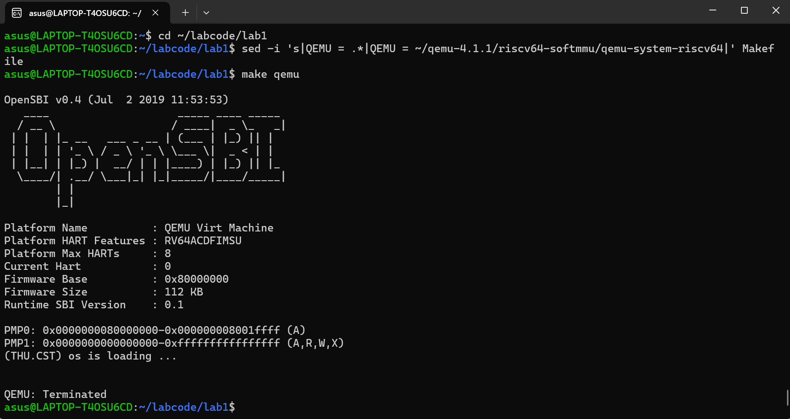

# 操作系统实验报告：Lab1 启动与调试

## 一、实验目的

本实验旨在通过 QEMU 模拟 RISC-V 平台，并利用 GDB 对系统启动过程进行跟踪调试。

其目标是理解 CPU 上电后的执行路径，掌握 OpenSBI 在引导过程中的作用，验证从复位地址开始到内核第一条指令执行（跳转到 0x80200000）的全过程。

## 二、实验环境

系统平台：Ubuntu 22.04 虚拟机  
QEMU 版本：7.0.0  
编译工具链：riscv64-unknown-elf-gcc  
调试工具：riscv64-unknown-elf-gdb  
OpenSBI 固件：系统内置（作为 QEMU 默认引导固件）  

## 三、实验步骤与调试过程

### 1.练习1：理解内核启动中的程序入口操作

阅读 kern/init/entry.S内容代码，我们对la sp, bootstacktop进行分析，可以看到la（Load Address）是一个伪指令，整条命令是将bootstacktop的地址加载到栈指针寄存器sp中。该指令中的bootstack是代码中定义的一块内存空间，而bootstacktop指向栈顶，将bootstacktop标签对应的内存地址值赋给sp寄存器，其实是设置当前栈指针指向预先分配的栈空间的顶部，整体目的是为CPU初始化了栈空间。

指令tail kern_init则实现了跳转到 kern_init 函数入口地址的执行，且不保存当前返回地址到 ra 寄存器。tail指令是RISC-V架构中的尾调用指令，执行时不会创建新的栈帧，而是复用当前栈帧。整条指令实现了从汇编启动代码转移到C语言编写的主初始化函数的过程，且执行后不会再回到 kern_entry。由于尾调用无需保留返回地址，避免了不必要的栈帧分配，能够节省栈空间、提高效率。

### 2.练习2：使用GDB验证启动流程

#### (1)启动 QEMU 并挂起等待调试

运行命令：make qemu

此时 QEMU 启动后暂停在复位入口，等待 GDB 连接。  
屏幕输出了 OpenSBI 启动信息，包括硬件平台、内存映射和固件起始地址（0x80000000）：  
Platform Name                  : riscv-virtio,qemu  
Platform HART Count       : 1  
Firmware Base                   : 0x80000000  
Firmware Size           	 : 252 KB  
Runtime SBI Version         : 0.3  
Domain0 Next Address    : 0x0000000000000000  
Domain0 Next Arg1          : 0x0000000087000000  
Domain0 Next Mode        : S-mode  
由此可以看出，OpenSBI 已加载到 0x80000000 处，准备跳转至下一阶段（内核加载）。  

如果使用qemu-4.1.1，运行截图如下：

可以看到内核正常启动，显示(THU.CST) os is loading ...  
同样对运行结果进行分析，可以看出 OpenSBI正常初始化并加载至加载到 0x80000000 处。

**OpenSBI 启动核（Boot HART）配置：**  
Boot HART ID                    : 0  
Boot HART Domain          : root  
Boot HART ISA                  : rv64imafdcsu  
Boot HART Features        : scounteren, mcounteren, time  
Boot HART PMP Count    : 16  
Boot HART PMP Granularity : 4  
Boot HART PMP Address Bits: 54  
Boot HART MHPM Count : 0  
Boot HART MIDELEG         : 0x0000000000001666  
Boot HART MEDELEG        : 0x000000000000f0b509  
这部分说明了硬件线程特性、PMP 安全机制和异常委托状态。

#### (2)连接 GDB 调试器

在另一个终端输入：  
make gdb  
等价于执行：  
riscv64-unknown-elf-gdb \  
    -ex 'file bin/kernel' \  
    -ex 'set arch riscv:rv64' \  
-ex 'target remote localhost:1234' 

成功连接后，GDB 输出：  
Remote debugging using localhost:12340x0000000000001000 in ?? ()  
说明当前 PC 指向 0x1000，这是 RISC-V 机器加电后的复位地址。

#### (3)查看启动指令

在 GDB 中输入：  
(gdb) x/10i $pc  
结果如下：  
=> 0x1000:  auipc  t0, 0x0  
   0x1004:  addi   a2, t0, 40  
   0x1008:  csrr   a0, mhartid  
   0x100c:  ld     a1, 32(t0)  
   0x1010:  ld     t0, 24(t0)  
   0x1014:  jr     t0  
这些指令来自 OpenSBI 的早期启动代码，用于：  
读取当前 hart ID；  
加载下一跳转地址（t0）；  
最终通过 jr t0 跳转到固件的主入口。  

#### (4)单步执行与寄存器变化追踪

依次执行：  
(gdb) si  
(gdb) info r t0  
多次单步执行后观察到：  
t0 = 0x1000  (4096)  
...  
t0 = 0x80000000  (2147483648)  
此时 PC 发生跳转：  
0x0000000080000000 in ?? ()  
这说明 CPU 已经从复位区（0x1000）跳转到 OpenSBI 主体所在的 0x80000000，开始执行固件初始化代码。

#### (5)分析 OpenSBI 到内核加载阶段

在 0x80000000 处反汇编：  
(gdb) x/10i $pc=> 0x80000000:  add s0, a0, zero  
   0x80000004:  add s1, a1, zero  
   0x80000008:  add s2, a2, zero  
   0x8000000c:  jal 0x80000560  
   ...   
这些指令属于 OpenSBI 主体，用于设置寄存器和调用内部初始化函数。  
这一阶段主要完成了：  
OpenSBI 初始化；  
将内核镜像从磁盘加载至内存；  
为 S-mode（Supervisor Mode）内核准备执行环境；  
最终将控制权转交给内核入口（0x80200000）。

#### (6)验证内核入口加载

为验证跳转是否成功，设置断点：  
(gdb) b *0x80200000  
Breakpoint 1 at 0x80200000: file kern/init/entry.S, line 7.  
(gdb) c  
Continuing.

随后程序命中断点：  
0x80200000 <kern_entry>: auipc sp,0x3  
0x80200004 <kern_entry+4>: mv sp,sp  
0x80200008 <kern_entry+8>: j 0x8020000a <kern_init>  
说明系统已成功跳转到内核入口 kern_entry，并将堆栈指针 sp 初始化完毕。  
此后程序进入 kern_init 函数执行内核初始化逻辑，标志着内核启动阶段正式开始。

## 四、实验现象与分析

**起始地址验证**  
GDB 显示 CPU 从 0x1000 开始执行，确认了复位向量的正确性。

**OpenSBI 加载确认**  
通过 info registers 可见跳转目标为 0x80000000，对应 OpenSBI 固件的入口。

**内核加载验证**  
在 0x80200000 设置断点后命中，表明 OpenSBI 已成功完成控制权交接。

## 五、实验结论

通过 QEMU 模拟与 GDB 调试，本实验完整追踪了 RISC-V 启动路径：

| 阶段            | 地址       | 执行内容                                  |
| --------------- | ---------- | ----------------------------------------- |
| 1  加电复位     | 0x1000     | 执行 OpenSBI 启动代码，加载 hart 信息     |
| 2  OpenSBI 主体 | 0x80000000 | 初始化硬件环境，准备内核加载              |
| 3  内核加载     | 0x80200000 | 进入 kern_entry，设置堆栈并跳转 kern_init |

