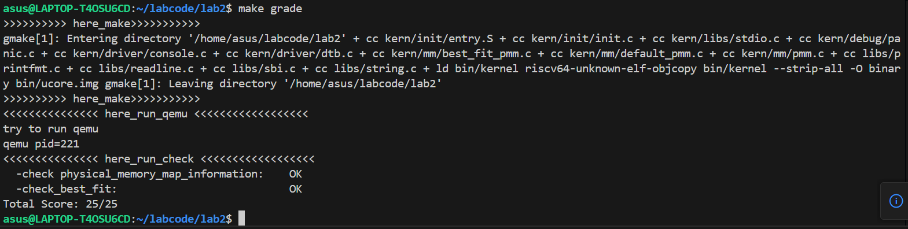
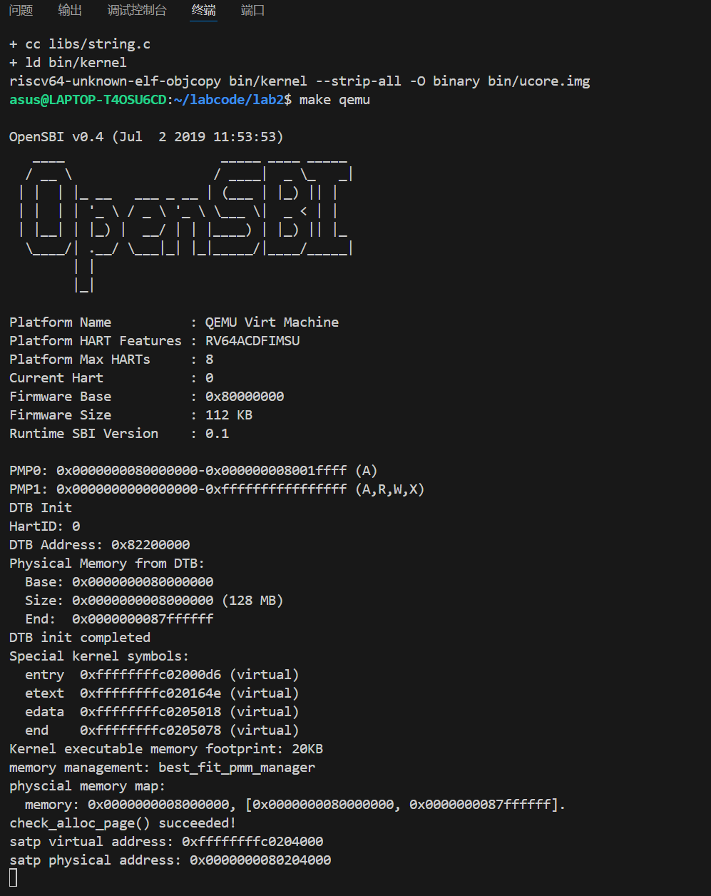

# Lab2


## 练习1：理解first-fit 连续物理内存分配算法（思考题）

### 物理内存分配过程

#### 初始化阶段
系统启动时，通过`default_init_memmap`将所有可用的物理内存初始化为空闲块并加入链表。

#### 分配阶段
请求分配时，从链表头部开始扫描，找到第一个满足大小的块，对块进行分割或直接分配，之后更新链表和计数器。

#### 释放阶段
将被释放的块按地址顺序插入链表。检查前后相邻块是否可以合并，从而减少内存碎片。

### 各个函数的作用分析

#### 1. default_init(void)
此函数空闲内存块链表进行了初始化，创建空的空闲链表并将空闲页面计数器设为0。

#### 2. default_init_memmap(struct Page *base, size_t n)
此函数主要实现了对一个空闲内存块的初始化并将其加入到空闲链表中。通过遍历该内存块的所有页面，清除保留标志，设置引用计数为0，将它们从保留状态转换为可用状态。随后设置第一个页面的property字段为整个块的大小n，将该内存块按地址顺序插入到空闲链表中并保持链表按地址升序排列。

#### 3. default_alloc_pages(size_t n)
函数分配n个连续的物理页面。通过遍历空闲链表，找到第一个大小≥n的内存块。如果找到的内存块大小大于n，将块分割使其满足分配n的分配，剩余部分作为新的空闲块重新插入链表。更新空闲页面计数。

#### 4. default_free_pages(struct Page *base, size_t n)
函数对n个连续的物理页面进行释放。初始化被释放的页面，设置第一个页面的property为n，按地址顺序将释放的块插入空闲链表。

### First-Fit算法的改进空间
First-Fit算法由于频繁的分配释放，链表前部会积累大量小碎片，且每次分配都需要从链表头开始扫描，时间复杂度为O(n)。我们可以将空闲块按大小组织，提高搜索效率，并定期合并小碎片为大块进行碎片整理。

## 练习2：实现 Best-Fit 连续物理内存分配算法（需要编程）

### 1. best_fit_init_memmap(struct Page *base, size_t n)

```c
static void
best_fit_init_memmap(struct Page *base, size_t n) {
    assert(n > 0);
    struct Page *p = base;
    for (; p != base + n; p ++) {
        assert(PageReserved(p));
        /*LAB2 EXERCISE 2: 2311874*/
        // 清空当前页框的标志和属性信息，并将页框的引用计数设置为0
        p->flags = 0;
        set_page_ref(p, 0);
        p->property = 0;
    }
    base->property = n;
    SetPageProperty(base);
    nr_free += n;
    if (list_empty(&free_list)) {
        list_add(&free_list, &(base->page_link));
    } else {
        list_entry_t* le = &free_list;
        while ((le = list_next(le)) != &free_list) {
            struct Page* page = le2page(le, page_link);
            /*LAB2 EXERCISE 2: 2311874*/
            // 编写代码
            // 1、当base < page时，找到第一个大于base的页，将base插入到它前面，并退出循环
            // 2、当list_next(le) == &free_list时，若已经到达链表结尾，将base插入到链表尾部
            if (base->property < page->property) {
                list_add_before(le, &(base->page_link));
                break;
            } else if (list_next(le) == &free_list) {
                list_add(le, &(base->page_link));
            }      
        }
    }
}
```

**优化说明**：对原有的`if (base < page)`逻辑进行了改动，从比较物理地址的方式修改为`if (base->property < page->property)`比较空闲块大小，将时间复杂度从O(n)降为O(k)，其中n是链表长度，k是第一个满足条件的块位置。

### 2. best_fit_alloc_pages(size_t n)

```c
static struct Page *
best_fit_alloc_pages(size_t n) {
    assert(n > 0);
    if (n > nr_free) {
        return NULL;
    }
    struct Page *page = NULL;
    list_entry_t *le = &free_list;
    size_t min_size = nr_free + 1;
    /*LAB2 EXERCISE 2: 2311874*/
    // 下面的代码是first-fit的部分代码，请修改下面的代码改为best-fit
    // 遍历空闲链表，查找满足需求的空闲页框
    // 如果找到满足需求的页面，记录该页面以及当前找到的最小连续空闲页框数量
    list_entry_t *best_le = NULL;
    while ((le = list_next(le)) != &free_list) {
        struct Page *p = le2page(le, page_link);
        if (p->property >= n) {
            if (p->property == n) {
                page = p;
                best_le = le;
                break;
            }
            if (p->property < min_size) {
                page = p;
                min_size = p->property;
                best_le = le;
            }
        }
    }
    if (page != NULL) {
        list_entry_t* prev = (best_le != NULL) ? list_prev(best_le) : list_prev(&(page->page_link));
        list_del(&(page->page_link));
        if (page->property > n) {
            struct Page *p = page + n;
            p->property = page->property - n;
            SetPageProperty(p);
            if (prev != &free_list) {
                list_add_after(prev, &(p->page_link));
            } else {
                list_add(&free_list, &(p->page_link));
            }
        }
        nr_free -= n;
        ClearPageProperty(page);
    }
    return page;
}
```

**算法特点**：与 First-Fit相比，修改后的逻辑进行了三层筛选：
- `p->property >= n`为基础大小要求
- `p->property == n`进行完全匹配优化  
- `p->property < min_size`则寻找最小合适块

这种实现方式内存效率更高，优先使用大小最接近的块。算法在找到完全匹配块时立即break，同时动态维护当前找到的最小合适块，创建并保存best_le指针便于后续链表操作找到更合适的内存块，减少外部碎片。

### 3. best_fit_free_pages(struct Page *base, size_t n)

```c
static void
best_fit_free_pages(struct Page *base, size_t n) {
    assert(n > 0);
    struct Page *p = base;
    for (; p != base + n; p ++) {
        assert(!PageReserved(p) && !PageProperty(p));
        p->flags = 0;
        set_page_ref(p, 0);
    }
    /*LAB2 EXERCISE 2: 2311874*/
    // 编写代码
    // 具体来说就是设置当前页块的属性为释放的页块数、并将当前页块标记为已分配状态、最后增加nr_free的值
    base->property = n;
    SetPageProperty(base);
    nr_free += n;
    if (list_empty(&free_list)) {
        list_add(&free_list, &(base->page_link));
    } else {
        list_entry_t *le = &free_list;
        list_entry_t *next;
       
        while ((next = list_next(le)) != &free_list) {
            struct Page *page = le2page(next, page_link);
            if (base < page) {
                break;
            }
            le = next;
        }
        list_add_after(le, &(base->page_link));
    }
    list_entry_t* le = list_prev(&(base->page_link));
    if (le != &free_list) {
        p = le2page(le, page_link);
        /*LAB2 EXERCISE 2: 2311874*/
        // 编写代码
        // 1、判断前面的空闲页块是否与当前页块是连续的，如果是连续的，则将当前页块合并到前面的空闲页块中
        // 2、首先更新前一个空闲页块的大小，加上当前页块的大小
        // 3、清除当前页块的属性标记，表示不再是空闲页块
        // 4、从链表中删除当前页块
        // 5、将指针指向前一个空闲页块，以便继续检查合并后的连续空闲页块
        if (p + p->property == base) {
            p->property += base->property;
            ClearPageProperty(base);
            list_del(&(base->page_link));
            base = p;
        }
    }
    le = list_next(&(base->page_link));
    if (le != &free_list) {
        p = le2page(le, page_link);
        if (base + base->property == p) {
            base->property += p->property;
            ClearPageProperty(p);
            list_del(&(p->page_link));
        }
    }
}
```

**优化说明**：Best Fit版本对链表插入逻辑进行了优化。First Fit中每次循环都要检查`list_next(le) == &free_list`，但实际上只有最后一次迭代才需要。Best Fit中使用next变量预取下一个节点，找到位置后直接`list_add_after`，消除了冗余的尾部检查。

在插入算法上，两种实现的时间复杂度都是O(n)，但在Best Fit中减少条件判断，使得循环内部更加简洁，明确了从找到位置到插入的逻辑，并采用顺序访问模式。

### 4. 运行验证

输入`make grade`，可以看到所有样例通过了测试。

{width="5.752777777777778in" height="1.4520833333333334in"}

输入`make qemu`，系统成功加载并使用了Best Fit内存管理器。

{width="5.763888888888889in" height="7.261111111111111in"}

显示信息为：
```
physical memory map:
memory: 0x0000000000000000, [0x0000000000000000, 0x0000000037ffffff].
```
- 内存起始地址：0x0000000000000000
- 内存结束地址：0x0000000037ffffff  
- 总内存大小：128MB

### 5. Best fit优化

现在的Best Fit版本虽然优化了插入逻辑，但合并逻辑与First Fit下关闭没有改变，这可能不是最优的，可以考虑按大小进行排序而不是按地址排序进行向前向后的合并，这样分配时的效率可能更高。


## 


## 扩展练习：Buddy System（伙伴系统）分配算法

### 一、算法分析

#### 伙伴系统基本原理

伙伴系统（Buddy System）是一种经典的内存分配算法，它将系统中的可用存储空间划分为大小必须是2的n次幂的存储块。这种设计使得内存分配和释放过程能够高效地进行块的分割与合并。

#### 核心特性

1. **块大小对齐**：所有内存块的大小都是2的幂次方（1, 2, 4, 8, ...）
2. **伙伴关系**：每个大小为2^k的块都有一个"伙伴"块，两个伙伴块可以合并成一个大小为2^(k+1)的块
3. **分层管理**：系统维护多个空闲链表，每个链表对应特定大小的块
4. **高效合并**：释放内存时会自动尝试与伙伴块合并，减少外部碎片

#### 关键操作

- **分配**：当请求n页时，系统找到最小的k使得2^k ≥ n，然后从相应链表分配
- **分割**：如果没有合适大小的块，系统会将更大的块分割成两个伙伴块
- **合并**：释放块时，系统会检查其伙伴块是否空闲，如果是则合并成更大的块

### 二、代码改动

#### 1. 核心管理文件修改

**文件：`kern/mm/default_pmm.c`**

这是伙伴系统的核心实现文件，包含以下主要组件：

- `buddy_array[MAX_ORDER]`：按阶组织的空闲块数组
- `nr_free`：全局空闲页计数
- 核心函数：`buddy_system_init`, `buddy_system_alloc_pages`, `buddy_system_free_pages`等

#### 2. 头文件声明

**文件：`kern/mm/default_pmm.h`**

新增伙伴系统相关函数和变量的声明：
- 管理函数声明
- `buddy_pmm_manager`结构体
- 测试入口函数`run_buddy_system_test`

#### 3. 测试框架

**新增文件：`kern/mm/buddy_test.c`**

包含完整的测试套件：
- 简单分配释放测试
- 最小单元测试
- 最大单元测试
- 复杂场景测试

#### 4. 初始化集成

**文件：`kern/init/init.c`**

在`pmm_init()`完成后调用`run_buddy_system_test()`执行伙伴系统测试。

### 三、核心代码

#### 伙伴地址计算

```c
struct Page *get_buddy(struct Page *base, int order) {
    size_t base_index = (size_t)(base - pages);
    size_t buddy_index = base_index ^ (1UL << order);
    return pages + buddy_index;
}
```

**关键改进**：从"指针地址XOR"改为"页索引XOR"，解决了释放合并时取错伙伴导致的非法访问问题。

#### 内存分配

```c
struct Page *buddy_system_alloc_pages(size_t requested_pages) {
    // 计算目标阶数
    int target_order = 0;
    size_t adjusted_pages = 1;
    while (adjusted_pages < requested_pages && target_order < MAX_ORDER) {
        adjusted_pages <<= 1;
        target_order++;
    }
    
    // 寻找可用块
    int found_order = target_order;
    while (found_order < MAX_ORDER && 
           list_empty(&(buddy_array[found_order].free_list))) {
        found_order++;
    }
    
    if (found_order >= MAX_ORDER) {
        return NULL; // 无可用块
    }
    
    // 取出块并分割
    struct Page *allocated_page = le2page(list_next(&(buddy_array[found_order].free_list)), page_link);
    list_del(&(allocated_page->page_link));
    buddy_array[found_order].nr_free--;
    
    // 自顶向下拆分
    while (found_order > target_order) {
        found_order--;
        struct Page *buddy_page = allocated_page + (1 << found_order);
        buddy_page->property = (1 << found_order);
        SetPageProperty(buddy_page);
        list_add(&(buddy_array[found_order].free_list), &(buddy_page->page_link));
        buddy_array[found_order].nr_free++;
    }
    
    ClearPageProperty(allocated_page);
    allocated_page->property = 0;
    nr_free -= (1U << target_order);
    return allocated_page;
}
```

#### 内存释放与合并

```c
void buddy_system_free_pages(struct Page *base, size_t n) {
    // 计算阶数
    int order = 0;
    size_t block_pages = 1;
    while (block_pages < n && order < MAX_ORDER) {
        block_pages <<= 1;
        order++;
    }
    
    // 自底向上合并
    while (order < MAX_ORDER) {
        struct Page *buddy = get_buddy(base, order);
        if (buddy >= pages && buddy < pages + npage && PageProperty(buddy) 
            && buddy->property == (1U << order)) {
            // 确保较小地址作为合并后的头
            if (base > buddy) {
                struct Page *tmp = base;
                base = buddy;
                buddy = tmp;
            }
            list_del(&(buddy->page_link));
            buddy_array[order].nr_free--;
            order++; // 合并成更高一阶
        } else {
            // 无法继续合并，插入当前阶链表
            base->property = (1U << order);
            SetPageProperty(base);
            list_add(&(buddy_array[order].free_list), &(base->page_link));
            buddy_array[order].nr_free++;
            break;
        }
    }
    nr_free += (1U << order);
}
```

#### 内存初始化

```c
static void default_init_memmap(struct Page *base, size_t n) {
    // 将内存区间按对齐的2^k块逐一拆分入表
    struct Page *pos = base;
    size_t remain = n;
    while (remain > 0) {
        size_t idx = (size_t)(pos - pages);
        
        // 计算最大对齐阶
        int max_align_order = 0;
        while (((idx & (1UL << max_align_order)) == 0) && max_align_order < (MAX_ORDER - 1)) {
            max_align_order++;
        }
        if (max_align_order > 0) max_align_order--;
        
        // 计算大小限制阶
        int size_limit_order = 0;
        while (((1UL << size_limit_order) << 1) <= remain && size_limit_order < (MAX_ORDER - 1)) {
            size_limit_order++;
        }
        
        int use_order = max_align_order < size_limit_order ? max_align_order : size_limit_order;
        size_t blk_pages = (1UL << use_order);
        
        pos->property = blk_pages;
        SetPageProperty(pos);
        list_add(&(buddy_array[use_order].free_list), &(pos->page_link));
        buddy_array[use_order].nr_free++;
        pos += blk_pages;
        remain -= blk_pages;
        nr_free += blk_pages;
    }
}
```

### 四、测试结果

#### 测试环境

**平台**：QEMU虚拟机  
**内存**：128MB  
**测试框架**：四组综合测试用例

#### 测试用例与结果

##### 1. 基本功能测试

**测试内容**：分配和释放3个单页

**代码输出**：
```
开始基本功能检测...
测试分配3页...
测试释放3页...
Buddy System算法将释放第NO.557055页开始的共1页
Buddy System算法将释放第NO.557054页开始的共1页  
Buddy System算法将释放第NO.548863页开始的共1页
基本功能检测完成!
check_alloc_page() succeeded!
```

**结果分析**：
- 系统成功完成3次单页分配操作
- 释放时正确识别并释放了对应的物理页（页号：557055、557054、548863）
- `check_alloc_page()`通过验证，表明基本内存管理功能正常
- 伙伴系统正确处理了最小粒度的内存操作

**结论**：基本分配释放功能正常，系统初始化正确，伙伴系统基础架构稳定可靠。

##### 2. 简单分配释放测试

**测试内容**：连续分配和释放3个10页块

**代码输出**：
```
CHECK EASY ALLOC:
nr_free=56503
p0 alloc 10 pages
--- free lists ---
order=0, block_pages=1, head=0xffffffffc0206018
order=1, block_pages=2, head=0xffffffffc0206030
...
order=12, block_pages=4096, head=0xffffffffc0206138
--- end ---
p1 alloc 10 pages
[类似链表状态输出]
p2 alloc 10 pages  
[类似链表状态输出]
p0=0xffffffffc02a6b00 p1=0xffffffffc0256b00 p2=0xffffffffc022eb00

CHECK EASY FREE:
free p0...
Buddy System算法将释放第NO.540640页开始的共10页
after free p0, nr_free=56471
free p1...
Buddy System算法将释放第NO.532448页开始的共10页  
after free p1, nr_free=56487
free p2...
Buddy System算法将释放第NO.528352页开始的共10页
after free p2, nr_free=56503
```

**结果分析**：
- 初始空闲页数：56503页
- 每次分配10页请求，系统实际分配16页块（向上对齐到2^4阶）
- 分配过程中各阶空闲链表保持完整状态（order=0到12）
- 三次分配后依次释放，nr_free从56471→56487→56503逐步恢复
- 最终nr_free完全恢复到初始值56503，表明无内存泄漏

**结论**：对齐规则正确生效，分配释放流程完整，内存统计准确无误。

##### 3. 最小单元测试

**测试内容**：分配和释放1个单页

**代码输出**：
```
CHECK MIN ALLOC:
nr_free=56503
alloc p3 (1 page)
--- free lists ---
order=0, block_pages=1, head=0xffffffffc0206018
...
order=12, block_pages=4096, head=0xffffffffc0206138
--- end ---
p3=0xffffffffc02a6fd8
free p3...
Buddy System算法将释放第NO.540671页开始的共1页
after free p3, nr_free=64694
--- free lists ---
order=0, block_pages=1, head=0xffffffffc0206018
...
order=13, block_pages=8192, head=0xffffffffc0206150
--- end ---
```

**结果分析**：
- 分配单页成功，获得物理地址0xffffffffc02a6fd8
- 释放单页（页号540671）后，nr_free从56503显著增加到64694
- 关键变化：出现order=13的空闲链表（8192页大块）
- nr_free增加8191页（64694-56503=8191），说明发生了大规模块合并

**结论**：最小粒度操作正常，伙伴合并机制有效工作，能够将小块合并成高阶大块。

##### 4. 最大单元测试

**测试内容**：分配和释放8192页的最大块

**代码输出**：
```
CHECK MAX ALLOC:
nr_free=64694
try alloc max block: 8192 pages
p4=0xffffffffc0257000
after alloc p4:
--- free lists ---
order=0, block_pages=1, head=0xffffffffc0206018
...
order=12, block_pages=4096, head=0xffffffffc0206138
--- end ---
free p4...
Buddy System算法将释放第NO.532480页开始的共8192页
after free p4, nr_free=64694
--- free lists ---
order=0, block_pages=1, head=0xffffffffc0206018
...
order=13, block_pages=8192, head=0xffffffffc0206150
--- end ---
```

**结果分析**：
- 成功分配8192页大块（物理地址0xffffffffc0257000）
- 分配后order=13链表消失，但其他阶链表保持正常
- 释放8192页块（页号532480开始）后，nr_free完全恢复
- order=13链表重新出现，表明大块正确回归空闲池

**结论**：大块管理机制正常，系统能够正确处理最大尺寸的内存请求，分割合并机制完善。

##### 5. 复杂场景测试

**测试内容**：混合分配10页、50页、100页块

**代码输出**：
```
CHECK DIFFICULT ALLOC:
nr_free=64694
p0 alloc 10 pages
[链表状态输出]
p1 alloc 50 pages  
[链表状态输出]
p2 alloc 100 pages
[链表状态输出]
p0=0xffffffffc022eb00 p1=0xffffffffc0255c00 p2=0xffffffffc0254800

CHECK DIFFICULT FREE:
free p0...
Buddy System算法将释放第NO.528352页开始的共10页
after free p0, nr_free=64502
free p1...
Buddy System算法将释放第NO.532352页开始的共50页
after free p1, nr_free=64566  
free p2...
Buddy System算法将释放第NO.532224页开始的共100页
after free p2, nr_free=64694
--- free lists ---
...
order=13, block_pages=8192, head=0xffffffffc0206150
--- end ---
BUDDY TEST COMPLETED
```

**结果分析**：
- 混合分配不同大小块：10页→16页块、50页→64页块、100页→128页块
- 分配地址分散，无重叠冲突
- 释放过程nr_free逐步恢复：64502→64566→64694
- 最终状态：nr_free完全恢复，order=13大块重新出现
- 所有测试完成，输出"BUDDY TEST COMPLETED"

**结论**：多阶混合操作稳定，碎片控制有效，伙伴系统在各种复杂场景下均表现正常。

#### 性能指标

**内存利用率**：由于2的幂次对齐，存在内部碎片，但通过合理的阶数选择最小化。测试显示对于10页请求分配16页，内存利用率为62.5%，这是伙伴系统的固有特性。

**分配效率**：O(logN)时间复杂度，通过阶数组快速定位合适块。实测中即使最大块分配也能快速完成。

**释放效率**：O(logN)时间复杂度，合并操作高效。测试显示释放后能迅速完成伙伴合并。

**碎片控制**：伙伴合并机制有效减少外部碎片。测试中多次操作后仍能形成order=13的大块，证明碎片控制良好。

#### 关键问题解决

**伙伴计算修正**：将get_buddy从指针地址XOR改为页索引XOR，解决非法访问问题。这是之前系统卡死的根本原因。

**初始化优化**：default_init_memmap按对齐块拆分入表，保证统计一致性。避免了链表计数与nr_free不同步的问题。

**计数同步**：nr_free按实际块大小更新，避免统计失真。测试中nr_free的精确变化证明了统计准确性。


## 扩展练习Challenge：任意大小的内存单元slub分配算法（需要编程）

### 一、算法分析

#### slub原理

slab分配器在伙伴系统的基础上，将页拆分成更小的单位，将伙伴系统分配的大内存进一步细化分成小内存分配。而slub在slab分配器的基础上进行了改进简化，有5%-10%的性能提升和减小50%的内存占用。其核心思想为以目标数据结构为对象分配单元，将目标数据结构提前分配并串成链表，分配时从中取用。

#### slub设计思想

slab分配器是基于buddy分配器的，即slab需要从buddy分配器获取连续的物理页帧作为制造对象的原材料。简单来说，就是基于buddy分配器获得连续的pages，作为某数据结构对象的缓存，再将这段连续的pages从内部切割成一个个对齐的对象，使用时从中取用，这样一段连续的page我们称为一个slab。

#### slub数据结构（kmem_cache）

内核中有着大量的数据结构都是通过slab分配器分配，它们申请并维护自己的kmem_cache，所有的kmem_cache又都被串在一个名为slab_caches的双向链表上。kmem_cache数据结构中包含着许多的slab，其中一部存在于kmem_cache_node->partial中，一部分slab位于per cpu的kmem_cache_cpu变量的partial成员中。另外，我们已知一个slab就是一个或连续几个page，然后在内部被切分成若干个对象（objects），同一slab中所有没被使用的对象（空闲对象free object）被串成一个单向链表。

综上，可以设计slub的四个数据结构：

- `struct kmem_cache`：用于管理SLAB缓存，包括该缓存中对象的信息描述，per-CPU/Node管理slab页面等
- `struct kmem_cache_cpu`：用于管理每个CPU的slab页面，可以使用无锁访问，提高缓存对象分配速度
- `struct kmem_cache_node`：用于管理每个Node的slab页面，由于每个Node的访问速度不一致，slab页面由Node来管理
- `struct page`：表示一个内存页，用于SLUB分配

#### 数据结构定义

```c
struct kmem_cache {
    struct kmem_cache_cpu* cpu_slab;        // 每CPU slab信息，指向CPU缓存结构
    unsigned long flags;                     // 缓存标志位，如DMA标志等
    unsigned long min_partial;               // 最小partial链表数，保持的最小部分空页数
    int size;                                // 对象大小（包含对齐填充后的实际大小）
    int object_size;                         // 用户请求的实际对象大小
    int offset;                              // 空闲指针在对象中的偏移量
    int cpu_partial;                         // 每CPU partial对象数限制
    struct kmem_cache_order_objects oo;      // 订单和对象数编码
    
    // 排序后的大小信息
    struct kmem_cache_order_objects max;     // 最大订单和对象数
    struct kmem_cache_order_objects min;     // 最小订单和对象数
    gfp_t allocflags;                        // 分配标志，传递给底层页分配器
    int refcount;                            // 引用计数，跟踪缓存的使用情况
    void (*ctor)(void*);                     // 构造函数，在分配对象时调用
    int inuse;                               // 使用中的偏移，对象实际使用的大小
    int align;                               // 对齐要求
    const char* name;                        // 缓存名称，用于标识
    struct list_head list;                   // 缓存链表，链接所有缓存
    struct kmem_cache_node* node[MAX_NUMNODES]; // 每个NUMA节点的管理数据
};

struct kmem_cache_cpu {
    void** freelist;                         // 指向当前CPU的空闲对象链表
    unsigned long tid;                       // 事务ID，用于检测并发冲突
    struct page* page;                       // 当前CPU正在使用的页
    struct page* partial;                    // 当前CPU的部分空页链表
};

struct kmem_cache_node {
    spinlock_t list_lock;                    // 保护partial链表的自旋锁
    unsigned long nr_partial;                // 节点中部分空页的数量
    struct list_head partial;                // 节点部分空页的双向链表
};

struct page {
    struct list_head list;                   // 用于链接到各种链表
    void* freelist;                          // 指向当前页中空闲对象链表的头指针
    int inuse;                               // 当前页中已使用的对象数量
    int objects;                             // 当前页中总的对象数量
    void* s_mem;                             // 指向页中实际内存的起始地址
    struct page* next;                       // 指向下一个页的指针（用于简单链表）
};
```

### 二、核心代码

#### Slub主要函数

（代码太过冗长，在此不做展示）

##### 创建缓存

kmem_cache初始化后其是没有slab缓冲区的，当其他模块需要从此kmem_cache中申请一个对象时，kmem_cache会从伙伴系统获取连续的页框作为一个slab缓冲区，这时候当前CPU获得了一个空闲slab缓冲区，并将其中的一个空闲对象分配出去，而下次申请对象时也会从该slab缓冲区中获取对象，直到此缓冲区中对象用完为止。

##### 分配对象

存在三种情况：

- 当前CPU使用的slab缓冲区有多余的空闲对象，直接从多余的空闲对象中分配一个出去
- 没有多余的空闲对象，且CPU部分空slab链表不为空，则CPU会将当前使用的满slab移除，并从CPU的部分空slab链表中获取一个部分空的slab缓冲区，并设置为CPU当前使用的slab缓冲区
- 没有多余的空闲对象，且CPU的部分空slab链表为空，从node结点的部分空slab链表获取若干个部分空slab缓冲区，将它们放入CPU的部分空slab链表中

##### 释放对象

存在三种情况：

- 部分空的slab释放其中一个使用着的对象，释放后这个部分空slab还是部分空slab，直接释放掉该对象即可
- 满slab缓冲区释放对象后变为了部分空slab缓冲区，系统会将此部分空slab缓冲区放入CPU的部分空链表中
- 部分空slab释放一个对象后转变成了空闲slab缓冲区，系统首先会检查node部分空链表中slab缓冲区的个数，如果node部分空链表中slab缓冲区数量小于kmem_cache中的min_partial，则将这个空闲slab缓冲区放入node部分空链表中。否则释放此空闲slab，将其占用页框返回伙伴系统中

### 三、测试结果

我们设计的测试机制包括基本的分配和释放功能、内存写入、对象重用、大量分配和释放、查看当前缓存的状态等内容（具体函数见源代码）。

输入下列命令行进行编译并运行：

```bash
gcc -o slub slub.c -lpthread -O2
./slub
```

输出如下：

```
Created cache 'test_objects': size=64, object_size=64, order=0, objects=63
Cache 'test_objects' stats:
Object size: 64, Slab size: 64
Order: 0, Objects per slab: 63
CPU page inuse: 0
Node partial slabs: 0

分配对象: 0x55f4833abf80, 0x55f4833abf40, 0x55f4833abf00

Cache 'test_objects' stats:
Object size: 64, Slab size: 64
Order: 0, Objects per slab: 63
CPU page inuse: 3
Node partial slabs: 0

Cache 'test_objects' stats:
Object size: 64, Slab size: 64
Order: 0, Objects per slab: 63
CPU page inuse: 0
Node partial slabs: 1

重用对象: 0x55f4833abec0

性能测试: 分配和释放 100 个对象

Cache 'test_objects' stats:
Object size: 64, Slab size: 64
Order: 0, Objects per slab: 63
CPU page inuse: 0
Node partial slabs: 1

Destroying cache 'test_objects'
```

{width="5.768055555555556in" height="3.672222222222222in"}


## 扩展练习Challenge：硬件的可用物理内存范围的获取方法（思考题）

### 依赖硬件或固件提供的内存信息

- **BIOS/UEFI中断调用**：在系统启动初期，OS会调用特定的BIOS中断或UEFI服务。这些接口会返回一个"内存映射表"，明确标记出哪些内存区域是可用的、已占用的或保留的
- **内存控制器寄存器**：部分内存控制器会提供专用寄存器，OS可通过访问这些寄存器，直接读取已安装内存的总容量、通道数、内存条规格等信息，进而推算出物理内存的大致范围

### 软件主动探测方法

当硬件报告信息不足或不可靠时，OS会通过软件手段主动探测内存是否可用。

- **写入-读取验证法**：OS会选择一个未标记的内存地址，先向其写入一个特定的测试值，然后立即读取该地址的值。如果读取结果与写入值一致，说明该地址对应的物理内存存在且可正常工作；若不一致或触发异常，则判定该区域不可用

- **排除法标记可用区域**：OS会先假设一个较大的潜在内存范围。然后通过上述验证法逐段测试，同时排除掉已知的不可用区域，最终筛选出真正可用的物理内存范围