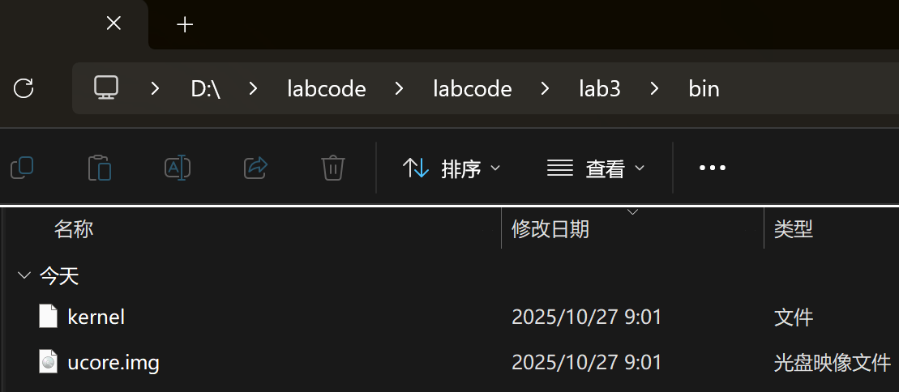
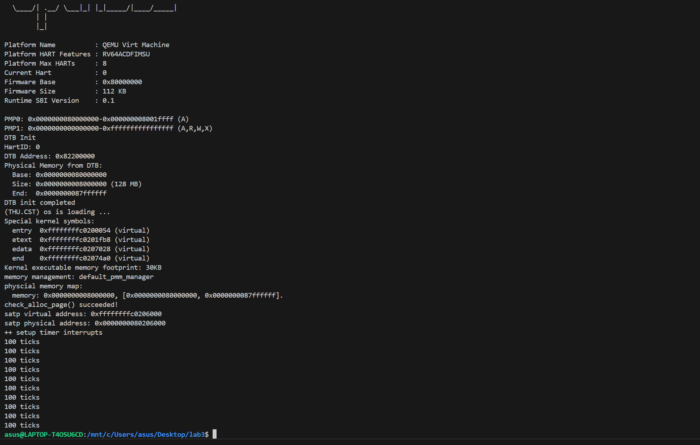
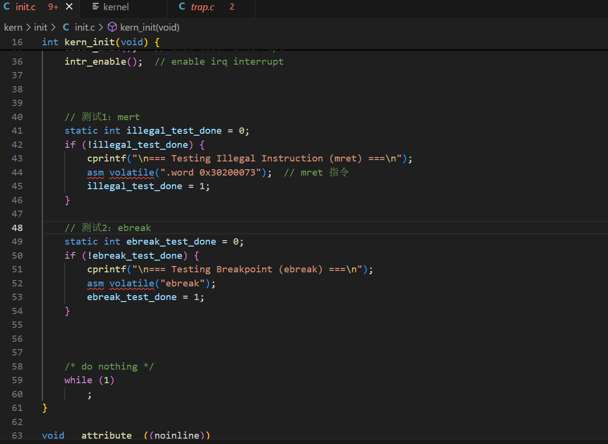
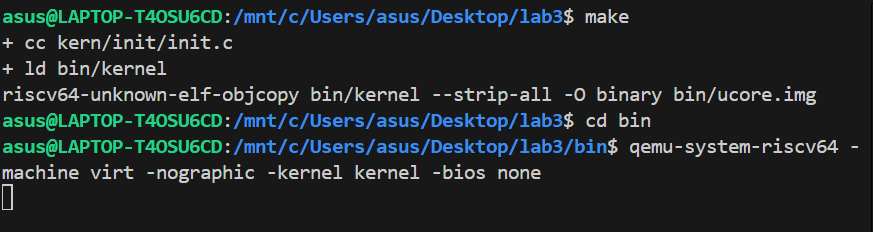

# Lab3

## 练习1：完善中断处理 （需要编程）

### 时钟中断原理

时钟中断是由硬件时钟部件定期触发的中断信号，是操作系统任务调度、时间管理的核心基础。在 RISC-V 架构中，时钟中断通过 `IRQ_S_TIMER` 标识，触发后需完成三项关键操作：

> - 重置中断触发条件：调用 `clock_set_next_event()` 设置下一次时钟中断时间。
> - 中断计数：通过全局变量累计中断次数，实现时间片管理的基础。
> - 中断响应：达到指定计数阈值后执行打印、关机等预设动作。

### 实现过程

#### 全局变量定义

```c
#include <sbi.h>
// volatile size_t ticks = 0; // 时钟中断计数器在 clock.h 中已经定义过，不再重复定义
static int print_count = 0; // 打印次数计数器
```

#### 时钟中断处理逻辑

```
case IRQ_S_TIMER:
    clock_set_next_event(); // 设置下次时钟中断
    ticks++; // 计数器加一
    if (ticks % TICK_NUM == 0) { // 每100次中断打印一次
        print_ticks();
        print_count++;
        if (print_count >= 10) { // 打印10次后关机
            sbi_shutdown();
        }
    }
    break;
```

在 `interrupt_handler` 函数的 `IRQ_S_TIMER` 分支补充了时钟中断的核心逻辑，通过 `clock_set_next_event()` 设置下一次时钟中断，用 `ticks` 变量统计中断次数，每累计100次调用 `print_ticks()`，用 `print_count` 记录打印次数，达到10次时调用 `shut_down()` 关机。

### 输出结果

使用命令 `make TARGET_ARCH=riscv` 编译内核，生成了内核镜像 `kernel` 文件，以及 `user.img`（用户程序镜像）。



>再使用命令

```bash
qemu-system-riscv64 -machine virt -nographic -kernel kernel
```

启动 QEMU，输出结果如下：



终端每累计100次时钟中断，输出一行 `100 ticks`；打印10行后，系统调用 `sbi_shutdown()` 正常关机，QEMU自动退出。该时钟中断处理逻辑正确实现了“计数-阈值响应-关机”的完整流程。


## 扩展练习 Challenge1：描述与理解中断流程

### ucore中断异常处理流程

**从异常产生开始的完整流程**：

1. **异常/中断发生**
   - CPU自动保存现场到CSR：
     - `sepc`：保存被中断指令的地址
     - `scause`：记录中断/异常原因
     - `stval`：提供附加信息（如缺页地址）
     - `sstatus`：保存中断使能状态和特权级信息

2. **跳转到中断入口点**
   - CPU根据`stvec`寄存器跳转到`__alltraps`

3. **保存完整上下文**
   ```assembly
   __alltraps:
       SAVE_ALL          # 保存所有寄存器到栈
       move a0, sp       # 传递trapframe指针给C函数
       jal trap          # 调用C中断处理函数
   ```

4. **中断分发与处理**
   ```c
   void trap(struct trapframe *tf) {
       trap_dispatch(tf);  // 分发给具体处理程序
   }
   ```

5. **恢复上下文并返回**
   ```assembly
   __trapret:
       RESTORE_ALL       # 从栈恢复寄存器
       sret             # 返回被中断的程序
   ```

### 关键问题解答

**1. `move a0, sp`的目的是什么？**
- 将栈指针`sp`（指向`trapframe`结构体）作为参数传递给C函数`trap`
- 按照RISC-V调用约定，第一个参数通过`a0`寄存器传递
- 这样C代码就能通过`trapframe`指针访问所有保存的寄存器状态

**2. SAVE_ALL中寄存器保存在栈中的位置是如何确定的？**
- 位置由`struct trapframe`的内存布局决定
- 通过`REGBYTES`常量计算偏移量：
  - 通用寄存器：`0*REGBYTES`到`31*REGBYTES`
  - CSR寄存器：`32*REGBYTES`到`35*REGBYTES`
- 这种布局与C语言中的结构体定义完全对应

**3. 对于任何中断，__alltraps中都需要保存所有寄存器吗？**
- **是的，需要保存所有寄存器**，理由如下：
  - **通用性**：中断处理程序不知道具体是哪种中断，统一保存确保安全
  - **完整性**：某些中断处理可能修改任意寄存器，需要完整上下文才能正确恢复
  - **嵌套中断**：虽然当前禁用嵌套，但设计上要考虑扩展性
  - **调试支持**：完整上下文便于调试和错误分析


## 扩展练习 Challenge2：理解上下文切换机制

### 关键操作分析

**`csrw sscratch, sp; csrrw s0, sscratch, x0`操作解析**：

```assembly
csrw sscratch, sp     # 将当前sp保存到sscratch
csrrw s0, sscratch, x0 # 将sscratch读到s0，同时将sscratch清零
```

**目的**：
1. **保存原始栈指针**：将进入中断前的栈指针安全保存
2. **处理特殊情况**：特别是对`sp`寄存器的特殊处理
3. **清空sscratch**：为可能的用户态中断处理做准备
4. **统一处理流程**：无论来自哪个特权级，都能正确处理栈指针

### CSR保存与恢复的哲学

**为什么保存stval、scause但不恢复？**

**保存的意义**：
1. **诊断信息**：为调试和错误处理提供完整信息
2. **处理依据**：C代码需要这些CSR值来判断中断原因和相关信息
3. **状态记录**：记录中断发生时的精确状态

**不恢复的理由**：
1. **只读性质**：`scause`、`stval`等CSR是**只读**的状态寄存器
2. **自动更新**：这些CSR由硬件自动设置，每次中断都会重新写入
3. **无持久价值**：它们只对当前中断处理有意义，不影响程序执行
4. **硬件管理**：`sepc`、`sstatus`等需要恢复，因为它们控制执行流程

**具体分析**：
- `scause`：中断原因，处理完成后就无意义
- `stval`：附加信息（如缺页地址），处理后不再需要  
- `sepc`：必须恢复，否则无法正确返回
- `sstatus`：必须恢复，否则中断使能状态会错误

这种设计体现了**最小必要原则**：只保存和恢复真正影响程序连续执行的状态，避免不必要的开销。


## 扩展练习 Challenge3：完善异常中断

### 异常中断原理

异常是 CPU 执行过程中出现的错误事件（如非法指令、断点），RISC-V 架构通过专用寄存器完成异常上下文管理：

- **stvec**：存储异常处理入口地址，实验中指向 `__alltraps` 函数
- **sepc**：保存异常发生时的指令地址，需在处理后更新以跳过异常指令
- **scause**：记录异常类型，用于区分非法指令（`CAUSE_ILLEGAL_INSTRUCTION`）与断点（`CAUSE_BREAKPOINT`）等事件

异常处理流程遵循"捕获 - 分析 - 恢复"三步：触发异常后，CPU 自动切换至内核态并保存上下文，通过 `scause` 识别异常类型并执行对应处理，最后更新 `sepc` 使程序恢复执行。

### 实现过程

#### 非法指令异常处理

```c
// 打印异常类型与发生地址
cprintf("Exception type:Illegal instruction\n");
cprintf("Illegal instruction caught at 0x%08x\n", tf->epc);
tf->epc += 4;  // 跳过异常指令（RISC-V指令长度为4字节）
```

#### 断点异常处理

```c
// 打印异常类型与发生地址
cprintf("Exception type: breakpoint\n");
cprintf("ebreak caught at 0x%08x\n", tf->epc);
tf->epc += 2;  // 跳过断点指令（RISC-V中ebreak指令长度为2字节）
```

#### 测试函数

```
// 测试1：非法指令异常
    cprintf("Testing mret (illegal instruction)...\n");
    asm("mret");

// 测试2：断点异常  
    cprintf("Testing ebreak (breakpoint)...\n");
    asm("ebreak");
```


### 输出结果

在 `init.c` 文件中添加测试代码。



编译运行测试命令：
```bash
qemu-system-riscv64 -machine virt -nographic -kernel kernel -bios none
```



从运行结果可以看出：

#### 1. 非法指令异常测试正确运行
- **触发指令**: `mret` (编码: `0x30200073`)
- **异常地址**: `0xc02000d8`
- **输出信息**:
  ```
  Exception type:Illegal instruction
  Illegal instruction caught at 0xc02000d8
  ```
- **SBI警告**: 表明系统尝试处理特权指令

#### 2. 断点异常测试正确运行
- **触发指令**: `ebreak`
- **异常地址**: `0xc02000be`
- **输出信息**:
  ```
  Exception type: breakpoint
  ebreak caught at 0xc02000be
  ```

### 实验中遇到的问题与更正

起初，我们以为RISC-V所有指令都是长度都是4字节，所以在异常和断点的处理当中都采用了`tf->epc += 4;`我们使用的测试函数如下：

```
// 测试1：mret
    static int illegal_test_done = 0;
    if (!illegal_test_done) {
        cprintf("\n=== Testing Illegal Instruction (mret) ===\n");
        asm volatile(".word 0x30200073");  // mret 指令
        illegal_test_done = 1;
    }
// 测试2：ebreak
    static int ebreak_test_done = 0;
    if (!ebreak_test_done) {
        cprintf("\n=== Testing Breakpoint (ebreak) ===\n");
        asm volatile("ebreak");
        ebreak_test_done = 1;
    }
```

在此情况下，并未出现报错提示和不正常输出。

在助教检查后我们得知，`ebreak`指令长度应当为2字节，所以我们检查了代码，希望找到错误的地址未产生异常输出的原因。查阅资料发现，RISC-V在编译时会将简单指令自动转换为压缩指令集，即2字节，我们使用命令`riscv64-unknown-elf-objdump -d bin/kernel > kernel_asm.txt`查看编译后的汇编代码如下：

```
ffffffffc02000c4:	30200073          	.word	0x30200073
ffffffffc02000c8:	4785                	li	a5,1
ffffffffc02000ca:	c01c                	sw	a5,0(s0)
ffffffffc02000cc:	b7ed                	j	ffffffffc02000b6 <kern_init+0x62>
ffffffffc02000ce:	00002517          	auipc	a0,0x2
ffffffffc02000d2:	f3250513          	addi	a0,a0,-206 # ffffffffc0202000 <etext+0x4>
ffffffffc02000d6:	046000ef          	jal	ffffffffc020011c <cprintf>
ffffffffc02000da:	9002                	ebreak
ffffffffc02000dc:	4785                	li	a5,1
ffffffffc02000de:	c01c                	sw	a5,0(s0)
ffffffffc02000e0:	b7e9                	j	ffffffffc02000aa <kern_init+0x56>
```

可以看到，`mret`指令（.word 0x30200073）为4字节，`ebreak`指令为2字节，但两个测试函数的后续指令流均被压缩为2字节，导致了在`ebreak`中`epc+4`也能跳转到有效指令位置，而不会出现地址未对齐引发的程序崩溃。所以，我们将测试函数修改为如上实现过程所示，在此情况下，`epc+4`输出了大量寄存器的当前值，但无法正常输出10次`100 ticks`，而修改为`epc+2`后，程序输出正确，问题解决。


## 实验知识点与OS原理对应关系

### 重要知识点对应表

| 实验知识点                        | OS原理知识点      | 含义、关系与差异理解                                         |
| --------------------------------- | ----------------- | ------------------------------------------------------------ |
| **中断帧(TrapFrame)**             | 上下文保存        | **含义**：实验通过具体结构体保存寄存器状态；原理描述抽象概念<br>**关系**：实验是实现，原理是设计思想<br>**差异**：实验需考虑具体架构(RSIC-V)的寄存器布局 |
| **中断向量表(stvec)**             | 中断描述符表(IDT) | **含义**：实验使用RISC-V的stvec；原理通常讲x86的IDT<br>**关系**：都是中断路由机制<br>**差异**：架构不同，RISC-V更简单，支持Direct和Vectored模式 |
| **中断委托机制(mideleg/medeleg)** | 中断处理分层      | **含义**：实验展示RISC-V特有委托机制；原理讲通用分层概念<br>**关系**：硬件对OS设计的支持<br>**差异**：RISC-V通过CSR明确委托，其他架构可能通过软件实现 |
| **上下文切换汇编代码**            | 模式切换          | **含义**：实验用汇编实现寄存器保存恢复；原理描述状态保存必要性<br>**关系**：实验是具体实现，原理是理论基础<br>**差异**：实验需处理架构细节(如sscratch特殊用法) |
| **时钟中断处理**                  | 时间片调度基础    | **含义**：实验实现简单ticks计数；原理包含完整调度算法<br>**关系**：实验验证基础机制<br>**差异**：实验只到中断触发，原理扩展到进程调度 |
| **中断使能控制(SIE)**             | 临界区保护        | **含义**：实验通过控制SIE位；原理讲原子操作概念<br>**关系**：都是确保操作不被中断<br>**差异**：实验是硬件级保护，原理可能包含软件锁 |

### 实验特有知识点

1. **RISC-V CSR操作**
   - `sstatus`、`sepc`、`scause`等特权寄存器使用
   - 架构特有的中断处理流程

2. **sscratch寄存器巧妙用法**
   - 区分用户态/内核态中断
   - 栈指针的临时保存

3. **OpenSBI固件接口**
   - `sbi_set_timer`等M-mode服务调用
   - 硬件抽象层的具体实现

## OS原理重要但实验未涉及的知识点

### 1. 中断控制器管理
- **APIC/XAPIC高级可编程中断控制器**
- 多核环境下的中断分配和负载均衡
- 中断优先级和屏蔽机制

### 2. 完整的中断生命周期管理
- 中断的注册、注销机制
- 中断处理程序的动态安装
- 中断共享和链式处理

### 3. 嵌套中断处理
- 中断处理期间允许更高优先级中断
- 中断栈的管理和切换
- 中断优先级控制

### 4. 用户态中断处理
- 信号机制与中断的关系
- 异步I/O完成通知
- 某些系统允许用户态直接处理特定中断

### 5. 实时系统中断处理
- 中断延迟的保证和测量
- 硬实时系统的中断响应时间
- 中断服务线程(IST)机制

### 6. 虚拟化环境中断处理
- 虚拟机的中断陷入和模拟
- 中断重映射(IOMMU)
- 虚拟中断控制器

### 7. 电源管理相关中断
- 系统休眠/唤醒的中断处理
- 时钟源切换和管理
- 低功耗模式下的中断行为

### 8. 错误恢复和容错机制
- 中断处理程序本身的错误处理
- 不可屏蔽中断(NMI)处理
- 机器检查异常和系统恢复

### 9. 性能优化相关
- 中断亲和性设置
- 中断合并和批处理
- 自适应中断频率调整

### 10. 安全相关机制
- 中断描述符表保护
- 中断处理程序的完整性验证
- 基于中断的侧信道攻击防护

这些未涉及的知识点反映了实验的简化性质，真实操作系统需要考虑更多的复杂性、性能优化和安全性要求。