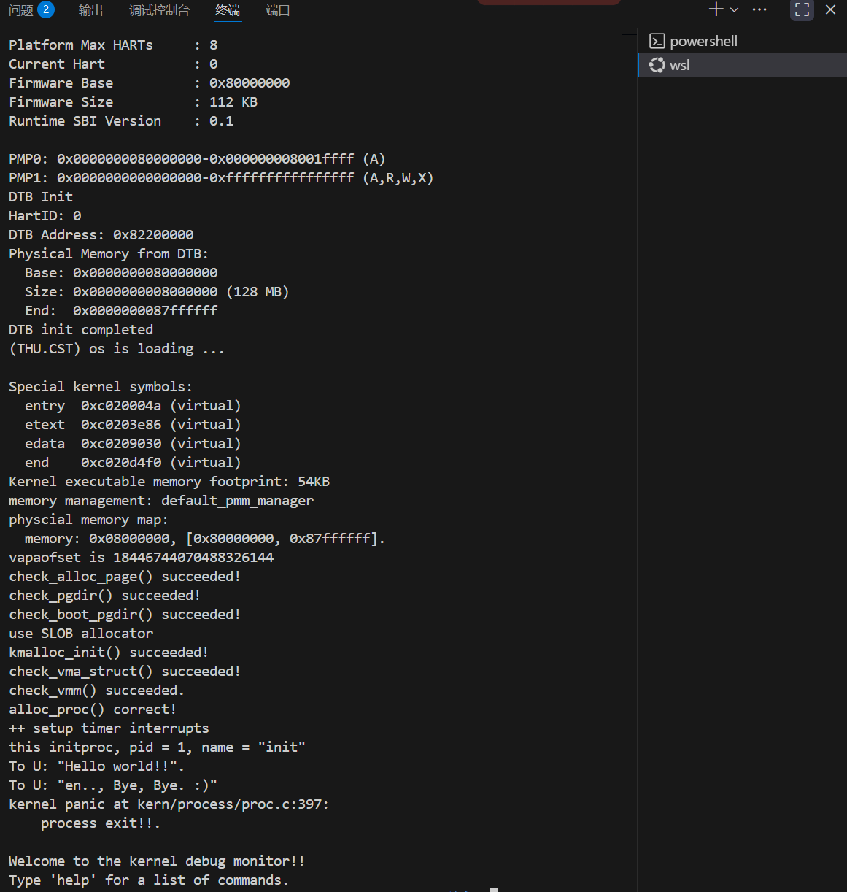

## 练习1：分配并初始化一个进程控制块（需要编码）

### **实现过程**

根据注释内容，我们可以看到结构信息包括十二条，各变量的初始化的值可以通过查看指导书、proc.h和proc_c后续代码中的函数proc_init()得到，最终完成初始化的alloc_proc()函数如下：<br>

```c
alloc_proc(void)

{

  struct proc_struct *proc = kmalloc(sizeof(struct proc_struct));

  if (proc != NULL)

  {

    proc->state = PROC_UNINIT;  // 进程状态为未初始化

    proc->pid = -1;       // 进程ID初始化为-1（无效）

    proc->runs = 0;       // 运行次数初始化为0

    proc->kstack = 0;      // 内核栈地址初始化为

    proc->need_resched = 0;   // 不需要调度，设为0

    proc->parent = NULL;     // 父进程指针为空

    proc->mm = NULL;       // 内存管理结构为空

    memset(&(proc->context), 0, sizeof(struct context)); // 上下文清零

    proc->tf = NULL;       // 陷阱帧指针为空

    proc->pgdir = boot_pgdir_pa;       // 页目录基址为boot_pgdir_pa

    proc->flags = 0;       // 进程标志为0

    memset(proc->name, 0, PROC_NAME_LEN); // 进程名清零

  }

  return proc;

}

```


### **问题**

请说明proc_struct中struct context context和struct trapframe *tf成员变量含义和在本实验中的作用是啥？（提示通过看代码和编程调试可以判断出来）<br>

**struct context context：**<br>

struct context 保存了进程的上下文信息，包括寄存器ra（返回地址）、sp（栈指针）和s0-s11（保存寄存器）的值。在进程切换时，将当前进程的上下文保存到 context 中，并还原下一个进程的上下文，主要用于内核线程切换时的现场保护和恢复。<br>

**struct trapframe tf：**<br>

struct trapframe 保存了中断/异常发生时的处理器状态，包括所有通用寄存器、特殊寄存器等。当发生中断、异常或系统调用时，当前CPU状态被保存到陷阱帧中。在进程第一次被调度执行时，通过陷阱帧来设置初始执行环境。<br>


## 练习2：do_fork 函数实现与线程ID唯一性分析<br>

### 设计实现过程<br>

#### **do_fork 函数实现总结**<br>

实现步骤<br>

1. **调用 alloc_proc()**：分配并初始化一个 proc_struct 结构体<br>
2. **调用 setup_kstack()**：为子进程分配内核栈空间<br>
3. **调用 copy_mm()**：根据 clone_flags 决定是复制还是共享内存管理信息（内核线程通常不需要）<br>
4. **调用 copy_thread()**：设置 trapframe 和 context，使新进程能够正确启动<br>
5. **设置父进程指针**：`proc->parent = current`<br>
6. **分配 PID 并添加到列表**（在禁用中断的临界区中）：<br>

  \- 调用 get_pid()获取唯一 PID<br>

  \- 调用 hash_proc()将进程添加到哈希表<br>

  \- 调用 list_add()将进程添加到进程列表<br>

  \- 增加 nr_process计数<br>

7. **调用 wakeup_proc()**：将新进程状态设置为 PROC_RUNNABLE<br>
8. **返回子进程的 PID**<br>


错误处理<br>

\- 如果 alloc_proc() 失败，直接返回错误<br>

\- 如果 setup_kstack() 失败，跳转到 bad_fork_cleanup_proc清理<br>

\- 如果 copy_mm() 失败，跳转到 ad_fork_cleanup_kstack清理内核栈<br>

 

### 问题回答：ucore是否做到给每个新fork的线程一个唯一的id？<br>

**是的，ucore能够保证每个新fork的线程都有一个唯一的ID。**<br>

**分析和理由：**<br>

1. PID 分配算法设计<br>

在 get_pid() 函数中，ucore实现了一个精心设计的PID分配算法：<br>

\- 使用静态变量 last_pid 和 next_safe 跟踪已分配的PID<br>

\- 遍历整个 proc_list，检查每个现有进程的PID，确保不冲突<br>

\- 如果 last_pid 已被占用，算法会递增并重新搜索，直到找到可用的PID<br>

\- 当 last_pid达到 MAX_PID 时，会回绕到1继续搜索<br>

 

2. 同步机制保障<br>

在 do_fork()函数中，PID分配和进程添加操作被包裹在临界区内：<br>

```c
local_intr_save(intr_flag);

{

  proc->pid = get_pid();

  hash_proc(proc);

  list_add(&proc_list, &(proc->list_link));

  nr_process++;

}

local_intr_restore(intr_flag);
```

\- local_intr_save() 和 local_intr_restore() 禁用了中断<br>

\- 在单核系统中，这保证了PID分配和进程注册操作的原子性<br>

\- 避免了并发情况下可能出现的PID冲突问题<br>

 

3. PID 范围设计<br>

系统定义了合理的PID范围：<br>

\- MAX_PID = MAX_PROCESS * 2 = 4096 * 2 = 8192<br>

\- MAX_PROCESS = 4096<br>

这样的设计确保了：<br>

\- PID空间足够大，能够容纳所有可能的进程<br>

\- 即使进程数量较多，也有足够的PID可供分配<br>

\- static_assert(MAX_PID > MAX_PROCESS)保证了数学上的可行性<br>

 

4. 冲突检测与处理<br>

算法具备完善的冲突检测机制：<br>

\- 每次分配都会扫描整个进程列表<br>

\- 发现冲突时自动递增PID并重新搜索<br>

\- 通过 next_safe变量优化搜索效率，减少不必要的全表扫描<br>

 

**结论**<br>

在ucore的设计假设下（单核系统或通过禁用中断实现同步），通过上述的PID分配算法、同步机制和范围设计，**每个新fork的线程都能获得一个全局唯一的进程ID**。这种设计在单核环境中是可靠且高效的，能够有效避免PID冲突问题。<br>

 

##  练习3：编写proc_run 函数（需要编码）<br>

proc_run 函数负责将指定的进程切换到CPU上运行，这是操作系统进程调度的核心功能。<br>

1. 函数声明和参数检查<br>

```c
void proc_run(struct proc_struct *proc)
{
    if (proc != current)    {
```

其中proc指向要切换到的进程控制块，检查如果要切换的进程就是当前正在运行的进程，直接返回，避免不必要的切换开销。<br>


2. 局部变量声明<br>

```c
bool intr_flag;
struct proc_struct *prev = current, *next = proc;
```

intr_flag用于保存中断状态，prev用于保存当前进程指针，即切换前的进程，next保存要切换到的进程指针。<br>


3. 执行部分<br>

 **禁用中断**<br>

local_intr_save(intr_flag);<br>

用于保存当前中断状态并禁用中断，防止在切换过程中被中断打断，造成状态不一致。<br>

**切换当前进程**<br>

current = proc;<br>

更新全局变量 current，指向新的当前进程。<br>

**切换页表**<br>

lsatp(next->pgdir);<br>

lsatp()`修改RISC-V的SATP(Supervisor Address Translation and Protection)寄存器，next->pgdir是新进程的页目录基地址。这能够切换虚拟地址空间，保证每个进程有独立的地址空间隔离，确保进程只能访问自己的内存区域。<br>

**上下文切换**<br>

switch_to(&(prev->context), &(next->context));<br>

prev->context为当前进程的上下文保存区域，next->context为新进程的上下文恢复区域。<br>

**恢复中断**<br>

local_intr_restore(intr_flag);<br>

恢复之前保存的中断状态，且在进程切换完成后才允许中断。<br>


### 在本实验的执行过程中，创建且运行了几个内核线程？<br>

**在本实验的执行过程中，创建且运行了2个内核线程**。<br>

1. 第一个内核线程：空闲线程 (idleproc)<br>

在 proc_init()函数中创建：<br>

```c
if ((idleproc = alloc_proc()) == NULL) {
    panic("cannot alloc idleproc.\n");
}
```

当没有其他线程可运行时，CPU执行空闲线程。<br>


2. 第二个内核线程：初始化线程 (initproc)<br>

同样存在于 proc_init()函数中：<br>

```c
int pid = kernel_thread(init_main, "Hello world!!", 0);
initproc = find_proc(pid);
set_proc_name(initproc, "init");
```


执行内容：<br>

```c
static int init_main(void *arg) {
    cprintf("this initproc, pid = %d, name = \"%s\"\n", current->pid, get_proc_name(current));
    cprintf("To U: \"%s\".\n", (const char *)arg);
    cprintf("To U: \"en.., Bye, Bye. :)\"\n");
    return 0;
}
```


### 完成代码编写后，编译并运行代码：make qemu<br>



运行成功。<br>


##  扩展练习 Challenge：<br>

### 1. 说明语句local_intr_save(intr_flag);....local_intr_restore(intr_flag);是如何实现开关中断的？<br>

这两个语句的定义位于kern/sync/sync.h<br>

```c
\#ifndef __KERN_SYNC_SYNC_H

\#define __KERN_SYNC_SYNC_H__

 

\#include <defs.h>

\#include <intr.h>

\#include <riscv.h>

 

static inline bool __intr_save(void) {

  if (read_csr(sstatus) & SSTATUS_SIE) {

    intr_disable();

    return 1;

  }

  return 0;

}

 

static inline void __intr_restore(bool flag) {

  if (flag) {

    intr_enable();

  }

}

 

\#define local_intr_save(x) \   

  do {          \   

    x = __intr_save(); \   

  } while (0)

\#define local_intr_restore(x) __intr_restore(x);

 

\#endif /* !__KERN_SYNC_SYNC_H__ */
```

当调用local_intr_save时，会读取sstatus寄存器，判断SIE位的值，如果该位为1，则说明中断是能进行的，这时需要调用intr_disable将该位置0，并返回1，将intr_flag赋值为1；如果该位为0，则说明中断此时已经不能进行，则返回0，将intr_flag赋值为0。这样就可以保证之后的代码执行时不会发生中断。<br>

当需要恢复中断时，调用local_intr_restore，判断intr_flag的值，如果其值为1，则需要调用intr_enable将sstatus寄存器的SIE位置1，否则该位依然保持0。以此来恢复调用local_intr_save之前的SIE的值。<br>


### 2. 深入理解不同分页模式的工作原理<br>

####  **get_pte()函数中两段相似代码的分析**<br>

 代码结构分析<br>

 在get_pte()函数中，我们看到两段结构相似的代码：<br>

```c
pte_t *get_pte(pde_t *pgdir, uintptr_t la, bool create)

{

  pde_t *pdep1 = &pgdir[PDX1(la)];

  if (!(*pdep1 & PTE_V))

  {

    struct Page *page;

    if (!create || (page = alloc_page()) == NULL)

    {

      return NULL;

    }

    set_page_ref(page, 1);

    uintptr_t pa = page2pa(page);

    memset(KADDR(pa), 0, PGSIZE);

    *pdep1 = pte_create(page2ppn(page), PTE_U | PTE_V);

  }

  pde_t *pdep0 = &((pte_t *)KADDR(PDE_ADDR(*pdep1)))[PDX0(la)];

  if (!(*pdep0 & PTE_V))

  {

    struct Page *page;

    if (!create || (page = alloc_page()) == NULL)

    {

      return NULL;

    }

    set_page_ref(page, 1);

    uintptr_t pa = page2pa(page);

    memset(KADDR(pa), 0, PGSIZE);

    *pdep0 = pte_create(page2ppn(page), PTE_U | PTE_V);

  }

  return &((pte_t *)KADDR(PDE_ADDR(*pdep0)))[PTX(la)];

}
```


```c
// get_page - get related Page struct for linear address la using PDT pgdir

struct Page *get_page(pde_t *pgdir, uintptr_t la, pte_t **ptep_store)

{

  pte_t *ptep = get_pte(pgdir, la, 0);

  if (ptep_store != NULL)

  {

    *ptep_store = ptep;

  }

  if (ptep != NULL && *ptep & PTE_V)

  {

    return pte2page(*ptep);

  }

  return NULL;

}
```

####  **不同分页模式的异同**<br>

 SV32, SV39, SV48 的共同点<br>

1. **多级页表结构**：<br>

  \- SV32：2级页表（页目录 + 页表）<br>

  \- SV39：3级页表（页目录指针 + 页目录 + 页表）  <br>

  \- SV48：4级页表（4级页目录 + 页目录指针 + 页目录 + 页表）<br>

 

2. **递归的查找过程**：<br>

  \- 每一级都使用虚拟地址的一部分作为索引<br>

  \- 检查有效位(PTE_V)<br>

  \- 如果不存在则分配新的页表<br>

 

3. **相同的页表项格式**：<br>

  \- 都包含PPN（物理页号）、有效位、权限位等<br>

 

#### **代码相似性的原因**<br>

两段代码相似是因为它们都遵循相同的**页表遍历模式**：<br>

```c
// 通用模式

pde_t *current_level = &prev_level[INDEX(la, level)];

if (!(*current_level & PTE_V)) {

  // 1. 检查是否需要创建

  if (!create) return NULL;

  

  // 2. 分配物理页

  struct Page *page = alloc_page();

  if (!page) return NULL;

  

  // 3. 初始化页表

  set_page_ref(page, 1);

  uintptr_t pa = page2pa(page);

  memset(KADDR(pa), 0, PGSIZE);

  

  // 4. 设置页表项

  *current_level = pte_create(page2ppn(page), PTE_U | PTE_V);

}
```

这种模式在SV39中需要重复3次（3级页表），在SV48中需要重复4次，但基本逻辑完全相同。<br>

 

#### **功能拆分的设计思考**<br>

当前合并实现的优缺点<br>

 优点：<br>

1. **接口简洁**：用户只需调用一个函数<br>

2. **原子性操作**：查找和分配在同一个临界区内完成<br>

3. **代码紧凑**：减少函数调用开销<br>


缺点：<br>

1. **单一职责原则违反**：一个函数承担了太多责任<br>
2. **可测试性差**：难以单独测试查找功能<br>
3. **代码重复**：多级页表遍历中存在相似代码段<br>
4. **灵活性不足**：调用者无法控制分配策略<br>


####  **推荐的拆分方案**<br>

// 方案1：完全拆分<br>

```c
pte_t *find_pte(pde_t *pgdir, uintptr_t la);  // 纯查找，可能返回NULL

int alloc_pte(pde_t *pgdir, uintptr_t la);   // 纯分配，返回错误码

pte_t *get_or_alloc_pte(pde_t *pgdir, uintptr_t la); // 当前功能的包装
```


// 方案2：基于回调的通用遍历函数<br>

```c
typedef int (*pte_alloc_func_t)(struct Page **page);

pte_t *page_walk(pde_t *pgdir, uintptr_t la, pte_alloc_func_t alloc_func);
```


####  **拆分的好处**<br>

1. **更好的模块化**：<br>

  // 可以单独测试查找功能<br>

```c
 void test_pte_find() {

    pte_t *ptep = find_pte(pgdir, la);

    assert(ptep == NULL); // 测试未映射的情况

  }
```

 

2. **代码复用**：<br>

  // 通用页表遍历函数可用于多种场景<br>

```c
 bool page_mapped(pde_t *pgdir, uintptr_t la) {

    return find_pte(pgdir, la) != NULL;

  }
```

 

3. **灵活的分配策略**：<br>

```c
// 调用者可以选择不同的分配策略

  if (find_pte(pgdir, la) == NULL) {

    if (should_alloc) {

      alloc_pte(pgdir, la);

    }

  }
```

 

4. **消除代码重复**：<br>

  // 通用多级页表遍历<br>

```c
for (int level = MAX_LEVEL; level > 0; level--) {

    pde_t *pdep = get_pde_at_level(pgdir, la, level);

    if (!(*pdep & PTE_V)) {

      if (!alloc_func(pdep)) return NULL;

    }

  }
```

  

####  **结论**<br>

1. **代码相似性**：由于RISC-V的不同分页模式都采用相同的多级页表理念，只是级别数量不同，导致遍历代码结构相似。<br>

2. **功能拆分必要性**：从软件工程角度，将查找和分配功能拆分是更好的设计选择，虽然会稍微增加接口复杂度，但能带来更好的可维护性、可测试性和代码复用性。 <br>

3. **平衡考虑**：在实际操作系统设计中，需要在性能和代码质量之间权衡。对于性能关键的路径，合并实现可能更合适；对于长期维护的项目，拆分设计更有价值。<br>