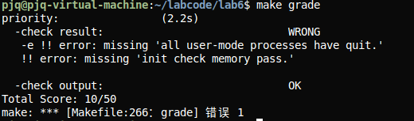

## Lab 6练习1: 理解调度器框架的实现（不需要编码）

### 调度类结构体 `sched_class`的分析

**结构体定义（来自 `kern/schedule/sched.h`）**

```c
struct sched_class {
  const char *name;                  // 调度器名称
  void (*init)(struct run_queue *rq);         // 初始化运行队列
  void (*enqueue)(struct run_queue *rq, struct proc_struct *proc); // 将进程加入队列
  void (*dequeue)(struct run_queue *rq, struct proc_struct *proc);  // 将进程移出队列
  struct proc_struct *(*pick_next)(struct run_queue *rq);      // 选择下一个运行的进程
  void (*proc_tick)(struct run_queue *rq, struct proc_struct *proc); // 处理时钟中断
};
```

**`init`：初始化运行队列**

调用时机：`sched_init()` 中（sched.c:59）

作用：初始化 run_queue（如初始化链表、设置 `proc_num = 0`）

**`enqueue`：将进程加入运行队列**

调用时机：

`wakeup_proc()` 中唤醒进程时（sched.c:76）

schedule() 中当前进程仍为 `PROC_RUNNABLE` 时（sched.c:96）

作用：将进程加入队列尾部，设置时间片

**dequeue：将进程移出运行队列**

调用时机：schedule() 中选择下一个进程后（sched.c:100）

作用：从队列中移除，准备运行

**pick_next：选择下一个运行的进程**

调用时机：schedule() 中选择下一个进程时（sched.c:98）

作用：按调度策略返回下一个进程（RR 返回队首）

**proc_tick：处理时钟中断**

调用时机：每次时钟中断时（trap.c:154）

作用：递减时间片，时间片耗尽时设置 need_resched = 1

**为什么使用函数指针而不是直接实现函数？**

解耦：框架代码与具体算法分离，框架不依赖具体实现

可扩展：新增调度算法只需实现 `sched_class` 并注册，无需修改框架

多态：运行时通过函数指针调用，支持动态切换

模块化：不同算法独立实现，便于维护

### 运行队列结构体 run_queue的分析

**Lab 6** **中的 run_queue** **定义（`kern/schedule/sched.h:40-47`**）

```c
struct run_queue {
  list_entry_t run_list;       // 链表（用于RR调度）
  unsigned int proc_num;        // 队列中的进程数
  int max_time_slice;         // 最大时间片
  skew_heap_entry_t *lab6_run_pool;  // 斜堆（用于stride调度）
};
```

**Lab 5** **与 Lab 6** **的差异**

Lab 5：通常直接使用链表管理就绪进程，调度逻辑硬编码

Lab 6：

引入 `sched_class` 框架

run_queue 同时支持链表（run_list）和斜堆（lab 6_run_pool）

添加 max_time_slice 等字段

**为什么需要支持两种数据结构？**

链表（run_list）：用于 RR，FIFO 操作简单

斜堆（lab 6_run_pool）：用于 stride，快速获取最小 stride 值

统一接口：通过 `sched_class` 统一，不同算法使用不同数据结构

### 调度器框架函数分析

**`sched_init()`** **的变化**

```c
void sched_init(void) {
  list_init(&timer_list);
  sched_class = &default_sched_class; // 设置调度类
  rq = &__rq;
  rq->max_time_slice = MAX_TIME_SLICE;
  sched_class->init(rq); // 调用调度类的初始化函数
  cprintf("sched class: %s\n", sched_class->name);
}
```

Lab 5：直接初始化运行队列

Lab 6：通过 `sched_class->init()` 初始化，支持不同算法

**wakeup_proc()** **的变化**

```c
void wakeup_proc(struct proc_struct *proc)
{
  assert(proc->state != PROC_ZOMBIE);
  bool intr_flag;
  local_intr_save(intr_flag);
  {
    if (proc->state != PROC_RUNNABLE)
    {
      proc->state = PROC_RUNNABLE;
      proc->wait_state = 0;
      if (proc != current)
      {
        sched_class_enqueue(proc);
      }
    }
    else
    {
      warn("wakeup runnable process.\n");
    }
  }
  local_intr_restore(intr_flag);
}
```

Lab 5：直接操作运行队列

Lab 6：通过 `sched_class->enqueue()` 加入队列，算法无关

**schedule()** **的变化**

```c
void schedule(void)
{
  bool intr_flag;
  struct proc_struct *next;
  local_intr_save(intr_flag);
  {
    current->need_resched = 0;
    if (current->state == PROC_RUNNABLE)
    {
      sched_class_enqueue(current);
    }
    if ((next = sched_class_pick_next()) != NULL)
    {
      sched_class_dequeue(next);
    }
    if (next == NULL)
    {
      next = idleproc;
    }
    next->runs++;
    if (next != current)
    {
      proc_run(next);
    }
  }
  local_intr_restore(intr_flag);
}
```

Lab 5：调度逻辑硬编码

Lab 6：通过函数指针调用，支持不同算法 

### 调度类的初始化流程

**完整流程**

```c
内核启动
 ↓
kern_init() (kern/init/init.c)
 ↓
proc_init() - 初始化进程管理
 ↓
sched_init() - 初始化调度器 (kern/schedule/sched.c:51)
 ├─ sched_class = &default_sched_class // 设置调度类指针
 ├─ rq = &__rq // 设置运行队列
 ├─ rq->max_time_slice = MAX_TIME_SLICE // 设置最大时间片
 └─ sched_class->init(rq) // 调用 RR_init()
   ├─ list_init(&(rq->run_list)) // 初始化链表
   ├─ rq->proc_num = 0 // 进程数清零
   └─ rq->lab6_run_pool = NULL // 斜堆指针置空
 ↓
调度器初始化完成
```

**`default_sched_class`** **的关联**

在 `kern/schedule/default_sched.c:106-113` 中定义：

```c
struct sched_class default_sched_class = {
  .name = "RR_scheduler",
  .init = RR_init,
  .enqueue = RR_enqueue,
  .dequeue = RR_dequeue,
  .pick_next = RR_pick_next,
  .proc_tick = RR_proc_tick,
};
```

关联方式：

sched_init() 中将 sched_class 指向 &default_sched_class

后续通过 sched_class->xxx() 调用具体实现

### 进程调度流程

**完整流程**

```c
时钟中断发生 (IRQ_S_TIMER)
 ↓
trap_dispatch() (kern/trap/trap.c)
 ↓
interrupt_handler() → IRQ_S_TIMER 分支
 ├─ clock_set_next_event() // 设置下次中断
 ├─ ticks++ // 计数器自增
 └─ sched_class_proc_tick(current) // 调用调度类的tick处理
   └─ RR_proc_tick(rq, proc)
     ├─ proc->time_slice-- // 时间片减1
     └─ if (proc->time_slice == 0)
       └─ proc->need_resched = 1 // 设置重新调度标志
 ↓
中断返回前检查 need_resched
 ↓
if (current->need_resched) {
  schedule() // 调用调度函数
   ├─ current->need_resched = 0 // 清除标志
   ├─ if (current->state == PROC_RUNNABLE)
   │  └─ sched_class_enqueue(current) // 将当前进程重新加入队列
   ├─ next = sched_class_pick_next() // 选择下一个进程
   ├─ if (next != NULL)
   │  └─ sched_class_dequeue(next) // 从队列中移除
   └─ proc_run(next) // 切换到下一个进程
     ├─ current = next
     ├─ lsatp(next->pgdir) // 切换页表
     └─ switch_to(prev->context, next->context) // 上下文切换
}
```

**need_resched** **标志位的作用**

含义：表示当前进程需要被重新调度

设置时机：

RR_proc_tick() 中时间片耗尽时（default_sched.c:102）

do_yield() 中主动让出 CPU（proc.c:831）

检查时机：

中断返回前（trap.c:285）

cpu_idle() 循环中（proc.c:1054）

作用：

延迟调度：不在中断处理中直接调度，而是设置标志，在安全时机调度

避免重复调度：设置后清除，避免重复触发

### 调度算法的切换机制

**添加新调度算法（如 stride）需要修改的代码**

**1.创建新的调度类实现文件（如 `default_sched_stride.c`）**

实现 `stride_init(), stride_enqueue(), stride_dequeue(), stride_pick_next(), stride_proc_tick()`

**2.定义新的调度类结构体**

```c
 struct sched_class stride_sched_class = {
    .name = "stride_scheduler",
    .init = stride_init,
    .enqueue = stride_enqueue,
    .dequeue = stride_dequeue,
    .pick_next = stride_pick_next,
    .proc_tick = stride_proc_tick,
  };
```

**3.修改 `sched_init()` 中的调度类选择（sched.c:55）**

  // 从：

  `sched_class = &default_sched_class;`

  // 改为：

  `sched_class = &stride_sched_class;`

**4.确保 run_queue 支持所需数据结构**

stride 使用斜堆，run_queue 已有 lab 6_run_pool 字段

**为什么当前设计使切换变得容易？**

接口统一：所有算法实现相同的 `sched_class` 接口

框架解耦：框架代码不依赖具体算法，只需切换指针

数据结构支持：run_queue 同时支持链表和斜堆

无需修改调用点：schedule(), `wakeup_proc()` 等通过函数指针调用，无需改动

**切换示例**

```c
// 在 sched_init() 中只需修改一行：
sched_class = &stride_sched_class; // 从 RR 切换到 stride
// 所有后续调用自动使用新的调度算法：
// - sched_class->init() → stride_init()
// - sched_class->enqueue() → stride_enqueue()
// - sched_class->pick_next() → stride_pick_next()
// 等等...
```


## Lab 6练习2: 实现 Round Robin 调度算法（需要编码）

### 比较 Lab 5 和 Lab 6中实现不同的函数

**schedule()** **函数**

**Lab 5** **中的实现：**

```c
// Lab5 中 schedule() 直接操作运行队列
void schedule(void) {
  // 直接操作全局运行队列，硬编码调度逻辑
  if (current != NULL && current->state == PROC_RUNNABLE) {
    list_add_before(&run_list, &(current->run_link));
  }
  next = list_next(&run_list);
  proc_run(next);
}
```

**Lab6** **中的实现：**

```c
void schedule(void)
{
  bool intr_flag;
  struct proc_struct *next;
  local_intr_save(intr_flag);
  {
    current->need_resched = 0;
    if (current->state == PROC_RUNNABLE)
    {
      sched_class_enqueue(current); // 通过函数指针调用
    }
    if ((next = sched_class_pick_next()) != NULL) // 通过函数指针调用
    {
      sched_class_dequeue(next); // 通过函数指针调用
    }
    if (next == NULL)
    {
      next = idleproc;
    }
    next->runs++;
    if (next != current)
    {
      proc_run(next);
    }
  }
  local_intr_restore(intr_flag);
}
```

**主要改动**

1.使用函数指针：通过 sched_class->enqueue(), sched_class->pick_next(), sched_class->dequeue() 调用，而不是直接操作队列

2.解耦调度策略：框架代码不依赖具体算法实现

3.支持多种调度算法：可以切换不同的 sched_class

**为什么需要这个改动？**

可扩展性：添加新调度算法只需实现 sched_class 接口，无需修改框架代码

代码复用：框架代码可以被多种算法复用

维护性：算法实现独立，便于维护和测试

灵活性：可以在运行时切换调度算法

**不做这个改动会出什么问题？**

无法支持多种调度算法：每次切换算法都要修改 schedule() 函数

代码耦合：调度逻辑与框架代码混在一起

难以测试：无法独立测试不同的调度算法

违反开闭原则：对扩展开放、对修改关闭

 

### 每个函数的实现思路和方法

**`RR_init()` -** **初始化运行队列**

```c
static void RR_init(struct run_queue *rq)
{
  list_init(&(rq->run_list));
  rq->proc_num = 0;
  rq->lab6_run_pool = NULL;
}
```

**实现思路：**

初始化 run_list 为空循环链表

将 proc_num 置 0

将 lab6_run_pool 置 NULL（RR 不使用斜堆）

**边界处理：**

list_init() 已处理空链表初始化

**RR_enqueue() -** **将进程加入队列**

```c
static void RR_enqueue(struct run_queue *rq, struct proc_struct *proc)
{
  assert(list_empty(&(proc->run_link)));
  list_add_before(&(rq->run_list), &(proc->run_link));
  if (proc->time_slice == 0 || proc->time_slice > rq->max_time_slice) {
    proc->time_slice = rq->max_time_slice;
  }
  proc->rq = rq;
  rq->proc_num ++;
}
```

**实现思路：**

使用 list_add_before(&(rq->run_list), ...) 将进程插入到 run_list 之前，实现尾部插入（因为 run_list 是哨兵节点）

时间片处理：如果为 0 或大于最大值，设置为 max_time_slice

更新 proc->rq 和 rq->proc_num

**为什么选择 list_add_before：**

run_list 是哨兵节点，list_add_before(&run_list, ...) 等价于尾部插入，符合 RR 的 FIFO 语义

**边界处理：**

使用 `assert(list_empty(&(proc->run_link)))` 确保进程不在队列中，防止重复入队

时间片为 0 或过大时重置为 max_time_slice

**RR_dequeue() -** **将进程移出队列**

```c
static void RR_dequeue(struct run_queue *rq, struct proc_struct *proc)
{
  assert(!list_empty(&(rq->run_list)));
  assert(proc->rq == rq);
  list_del_init(&(proc->run_link));
  rq->proc_num --;
  proc->rq = NULL;
}
```

**实现思路：**

使用 list_del_init() 从队列中移除进程并初始化 run_link

更新 proc_num 和 proc->rq

**边界处理：**

使用断言确保队列非空和进程属于该队列

清除 `proc->rq`，避免悬空指针

**RR_pick_next() -** **选择下一个运行的进程**

```c
static struct proc_struct * RR_pick_next(struct run_queue *rq)
{
  list_entry_t *le = list_next(&(rq->run_list));
  if (le != &(rq->run_list)) {
    return le2proc(le, run_link);
  }
  return NULL;
}
```

**实现思路：**

返回队列头部进程（FIFO）

使用 le2proc(le, run_link) 将链表节点转换为进程指针

**边界处理：**

队列为空时返回 NULL（由 schedule() 处理，选择 idleproc）

**`RR_proc_tick()` -** **处理时钟中断**

```c
static void RR_proc_tick(struct run_queue *rq, struct proc_struct *proc)
{
  if (proc->time_slice > 0) {
    proc->time_slice --;
  }
  if (proc->time_slice == 0) {
    proc->need_resched = 1;
  }
}
```

**实现思路：**

每次时钟中断递减时间片

时间片耗尽时设置 need_resched = 1

**边界处理：**

时间片为 0 时不再递减，避免下溢

时间片耗尽时设置标志，由中断返回路径检查并触发调度

**调用时机（trap.c:152-155**）：

```c
if (current != NULL)
{
  sched_class_proc_tick(current);
}
```

### 输出结果

**make grade** **输出结果**



**说明：**

check output: OK：系统能正常启动，输出了初始化信息

check result: WRONG：测试程序未在预期时间内完成

可能原因：测试程序运行时间较长，在 100 ticks 内未完成（DEBUG_GRADE 模式下会在 100 ticks 后 panic）

**`QEMU`** **中观察到的调度现象**

运行 `make qemu` 时观察到的现象：

**初始化信息：**

```
sched class: RR_scheduler
++ setup timer interrupts

```

**进程创建和优先级设置：**

```
kernel_execve: pid = 2, name = "priority".
set priority to 6
set priority to 1
set priority to 2
set priority to 3
set priority to 4
set priority to 5

```

**时间片轮转：**

每 5 个时钟中断（MAX_TIME_SLICE = 5）进行一次进程切换

进程按照 FIFO 顺序轮流执行

**调度行为：**

所有进程获得相等的 CPU 时间

进程按照创建顺序轮转执行

时间片耗尽后自动切换到下一个进程

### Round Robin 调度算法分析

**优点**

公平性：所有就绪进程获得相等的时间片

响应性：每个进程都能定期获得 CPU

实现简单：使用 FIFO 队列，逻辑清晰

无饥饿：每个进程都能执行

**缺点**

平均等待时间长：短任务可能等待多个长任务

上下文切换开销：频繁切换增加开销

不考虑优先级：所有进程同等对待

时间片选择困难：太小增加开销，太大降低响应性

**如何调整时间片大小来优化系统性能**

当前实现中，MAX_TIME_SLICE = 5（定义在 kern/schedule/sched.h:8）

**调整策略：**

1.时间片过小（如 1-2）：

优点：响应快

缺点：上下文切换开销大，吞吐量下降

2.时间片适中（如 5-10）：

平衡响应性和吞吐量

适合大多数场景

3.时间片过大（如 20+）：

优点：减少切换开销，吞吐量高

缺点：响应性差，交互体验下降

**优化建议：**

交互式系统：较小时间片（3-5）

批处理系统：较大时间片（10-20）

混合系统：可考虑动态调整或优先级时间片

**为什么需要在 RR_proc_tick** **中设置 need_resched** **标志？**

**原因：**

1.延迟调度：不在中断处理中直接调用 schedule()，而是设置标志，在安全时机调度

中断处理应尽量简短

避免在中断上下文中进行复杂操作

2.统一调度入口：所有需要调度的场景都通过检查 `need_resched` 触发，统一在 schedule() 中处理

3.避免重复调度：设置标志后清除，避免重复触发

4.中断安全：在中断返回前检查标志，保证在正确的上下文中调度

**代码流程：**

```c
// 时钟中断处理（trap.c:152-155）
sched_class_proc_tick(current); // 时间片减1，如果为0则设置 need_resched = 1
// 中断返回前检查（trap.c:285）
if (current->need_resched) {
  schedule(); // 在安全时机进行调度
}
```

### 拓展思考

**如果要实现优先级 RR** **调度，代码需要如何修改？**

优先级 RR 调度： 不同优先级的进程获得不同的时间片，高优先级进程优先执行。

修改方案：

**1.修改 run_queue** **结构：**

```c
struct run_queue {
    list_entry_t run_list;
    list_entry_t priority_list[PRIORITY_MAX]; // 按优先级分组的队列
    unsigned int proc_num;
    int max_time_slice;
};
```

**2.修改 RR_enqueue()**：

```c
struct run_queue {
    list_entry_t run_list;
    list_entry_t priority_list[PRIORITY_MAX]; // 按优先级分组的队列
    unsigned int proc_num;
    int max_time_slice;
};
```

**3.修改 RR_pick_next()**：

```c
static struct proc_struct *
  RR_pick_next(struct run_queue *rq)
  {
    // 从高优先级到低优先级查找
    for (int i = PRIORITY_MAX - 1; i >= 0; i--) {
      list_entry_t *le = list_next(&(rq->priority_list[i]));
      if (le != &(rq->priority_list[i])) {
        return le2proc(le, run_link);
      }
    }
    return NULL;
}
```

**当前的实现是否支持多核调度？**

不支持。 原因：

1.单一运行队列：`static struct run_queue __rq;（sched.c:49）`是全局单一队列

2.无 CPU 绑定：进程未绑定到特定 CPU

3.无负载均衡：无跨 CPU 的负载均衡机制

4.无锁保护：多核环境下需要锁保护共享数据结构

**如何改进以支持多核调度？**

改进方案：

**1.每个 CPU** **一个运行队列：**

`struct run_queue rq[NR_CPUS]; // 每个 CPU 一个运行队列`

**2.添加 CPU 绑定：**

```c
struct proc_struct {
    int cpu_id; // 进程绑定的 CPU ID
};
```

**3.实现负载均衡：**

```c
void load_balance(void) {
    // 定期检查各 CPU 的负载
    // 将进程从负载高的 CPU 迁移到负载低的 CPU
}
```

**4.添加锁保护：**

```c
struct run_queue {
    spinlock_t lock; // 保护运行队列的锁
    list_entry_t run_list;
};
```

**5.** **修改 schedule()：**

```c
void schedule(void) {
    int cpu_id = get_cpu_id();
    struct run_queue *rq = &rqs[cpu_id];
    // ... 后续逻辑使用 rq
}
```

