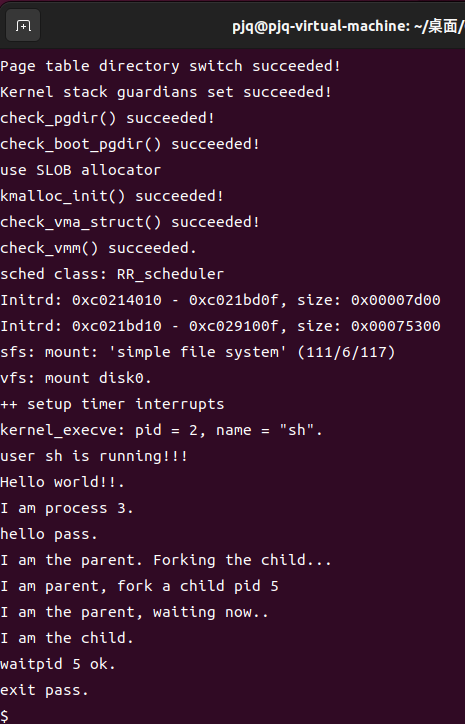

## 练习1：完成读文件操作的实现（需要编码）

### 实现思路

文件读写操作需要考虑三种情况：

1. **第一个块未对齐**：如果偏移量不是块大小的整数倍，需要处理第一个块的部分数据
2. **中间对齐的完整块**：处理中间完全对齐的块，可以使用整块操作提高效率
3. **最后一个块未对齐**：如果结束位置不是块大小的整数倍，需要处理最后一个块的部分数据

### 关键代码实现

```c
// 步骤(1)：处理第一个未对齐的块
blkoff = offset % SFS_BLKSIZE;
if (blkoff != 0) {
    size = (nblks != 0) ? (SFS_BLKSIZE - blkoff) : (endpos - offset);
    if ((ret = sfs_bmap_load_nolock(sfs, sin, blkno, &ino)) != 0) {
        goto out;
    }
    if ((ret = sfs_buf_op(sfs, buf, size, ino, blkoff)) != 0) {
        goto out;
    }
    alen += size;
    if (nblks == 0) {
        goto out;
    }
    buf += size;
    blkno++;
    nblks--;
}

// 步骤(2)：处理中间对齐的完整块
while (nblks > 0) {
    if ((ret = sfs_bmap_load_nolock(sfs, sin, blkno, &ino)) != 0) {
        goto out;
    }
    if ((ret = sfs_block_op(sfs, buf, ino, 1)) != 0) {
        goto out;
    }
    alen += SFS_BLKSIZE;
    buf += SFS_BLKSIZE;
    blkno++;
    nblks--;
}

// 步骤(3)：处理最后一个未对齐的块
if ((size = endpos % SFS_BLKSIZE) != 0) {
    if ((ret = sfs_bmap_load_nolock(sfs, sin, blkno, &ino)) != 0) {
        goto out;
    }
    if ((ret = sfs_buf_op(sfs, buf, size, ino, 0)) != 0) {
        goto out;
    }
    alen += size;
}
```

### 实现要点

1. **块映射**：使用 `sfs_bmap_load_nolock()` 根据逻辑块号获取物理块号

2. **部分块操作**：对于未对齐的块，使用 `sfs_buf_op()` 进行部分数据读写

3. **整块操作**：对于对齐的块，使用 `sfs_block_op()` 进行整块读写，提高效率

4. **缓冲区更新**：每次读写后需要更新缓冲区指针和已读写长度


---

## 练习2：完成基于文件系统的执行程序机制的实现

### 实现思路

程序加载过程分为以下步骤：

1. 创建新的内存管理结构
2. 创建页目录表
3. 读取并解析 ELF 文件头
4. 加载程序的各个段（TEXT、DATA、BSS）
5. 设置用户栈
6. 设置进程的页表和内存管理结构
7. 在用户栈中设置 `argc` 和 `argv`
8. 初始化 `trapframe`

### 关键代码实现

#### 文件系统支持 - `do_fork` 中的文件复制

在 `do_fork()` 函数中添加文件描述符表的复制：

```c
// LAB8: 复制父进程的文件描述符表
if (copy_files(clone_flags, proc) != 0)
{
    goto bad_fork_cleanup_fs;
}
```

`copy_files()` 函数实现：

- 如果设置了 `CLONE_FS` 标志，则共享文件描述符表
- 否则创建新的文件描述符表并复制父进程的文件描述符

#### 程序加载 - `load_icode` 函数

**创建内存管理结构和页目录**

```c
// 步骤(1)：为当前进程创建新的内存管理结构
if ((mm = mm_create()) == NULL) {
    goto bad_mm;
}
// 步骤(2)：创建新的页目录表，mm->pgdir 指向 PDT 的内核虚拟地址
if (setup_pgdir(mm) != 0) {
    goto bad_pgdir_cleanup_mm;
}
```

**加载 ELF 文件并解析**

```c
// 步骤(3)：将二进制文件中的 TEXT/DATA/BSS 部分复制到进程内存空间
struct elfhdr __elf, *elf = &__elf;
if ((ret = load_icode_read(fd, elf, sizeof(struct elfhdr), 0)) != 0) {
    goto bad_elf_cleanup_pgdir;
}
if (elf->e_magic != ELF_MAGIC) {
    ret = -E_INVAL_ELF;
    goto bad_elf_cleanup_pgdir;
}
```

**加载程序段**

```c
struct proghdr __ph, *ph = &__ph;
uint32_t vm_flags, perm;
int i;
for (i = 0; i < elf->e_phnum; i ++) {
    // 读取程序头
    off_t phoff = elf->e_phoff + sizeof(struct proghdr) * i;
    if ((ret = load_icode_read(fd, ph, sizeof(struct proghdr), phoff)) != 0) {
        goto bad_cleanup_mmap;
    }
    if (ph->p_type != ELF_PT_LOAD) {
        continue ;
    }
    
    // 设置虚拟内存标志和页表权限
    vm_flags = 0, perm = PTE_U | PTE_V;
    if (ph->p_flags & ELF_PF_X) vm_flags |= VM_EXEC;
    if (ph->p_flags & ELF_PF_W) vm_flags |= VM_WRITE;
    if (ph->p_flags & ELF_PF_R) vm_flags |= VM_READ;
    // RISC-V 架构的权限位设置
    if (vm_flags & VM_READ) perm |= PTE_R;
    if (vm_flags & VM_WRITE) perm |= (PTE_W | PTE_R);
    if (vm_flags & VM_EXEC) perm |= PTE_X;

    // 建立虚拟内存区域
    if ((ret = mm_map(mm, ph->p_va, ph->p_memsz, vm_flags, NULL)) != 0) {
        goto bad_cleanup_mmap;
    }

    // 加载文件内容到内存
    off_t offset = ph->p_offset;
    size_t off, size;
    uintptr_t start = ph->p_va, end, la = ROUNDDOWN(start, PGSIZE);
    
    end = ph->p_va + ph->p_filesz;
    struct Page *page = NULL;
    while (start < end) {
        if ((page = pgdir_alloc_page(mm->pgdir, la, perm)) == NULL) {
            goto bad_cleanup_mmap;
        }
        off = start - la, size = PGSIZE - off, la += PGSIZE;
        if (end < la) {
            size -= la - end;
        }
        if ((ret = load_icode_read(fd, page2kva(page) + off, size, offset)) != 0) {
            goto bad_cleanup_mmap;
        }
        start += size, offset += size;
    }
    
    // 初始化 BSS 段（清零）
    end = ph->p_va + ph->p_memsz;
    // ... BSS 段清零代码 ...
}
```

**设置用户栈**

```c
// 步骤(4)：调用 mm_map 设置用户栈，并将参数放入用户栈
vm_flags = VM_READ | VM_WRITE | VM_STACK;
if ((ret = mm_map(mm, USTACKTOP - USTACKSIZE, USTACKSIZE, vm_flags, NULL)) != 0) {
    goto bad_cleanup_mmap;
}
// 分配栈页
assert(pgdir_alloc_page(mm->pgdir, USTACKTOP - PGSIZE, PTE_USER) != NULL);
assert(pgdir_alloc_page(mm->pgdir, USTACKTOP - 2 * PGSIZE, PTE_USER) != NULL);
assert(pgdir_alloc_page(mm->pgdir, USTACKTOP - 3 * PGSIZE, PTE_USER) != NULL);
assert(pgdir_alloc_page(mm->pgdir, USTACKTOP - 4 * PGSIZE, PTE_USER) != NULL);
```

**设置进程的页表和内存管理**

```c
// 步骤(5)：设置当前进程的 mm、页表基址，重置页目录（使用 lsatp 宏）
mm_count_inc(mm);
current->mm = mm;
current->pgdir = PADDR(mm->pgdir);
lsatp(PADDR(mm->pgdir));
flush_tlb();
```

**设置 argc 和 argv**

```c
// 步骤(6)：在用户栈中设置 uargc 和 uargv
uintptr_t stacktop = USTACKTOP;
uintptr_t uargv_ptrs[EXEC_MAX_ARG_NUM + 1];
for (i = 0; i < argc; i ++) {
    size_t len = strlen(kargv[i]) + 1;
    stacktop -= len;
    uargv_ptrs[i] = stacktop;
    if (!copy_to_user(mm, (void *)stacktop, kargv[i], len)) {
        ret = -E_INVAL;
        goto bad_cleanup_mmap;
    }
}
uargv_ptrs[argc] = 0;

stacktop -= (stacktop % sizeof(uintptr_t));
stacktop -= (argc + 1) * sizeof(uintptr_t);
if (!copy_to_user(mm, (void *)stacktop, uargv_ptrs, (argc + 1) * sizeof(uintptr_t))) {
    ret = -E_INVAL;
    goto bad_cleanup_mmap;
}
```

**初始化 trapframe**

```c
// 步骤(7)：为用户环境设置 trapframe
struct trapframe *tf = current->tf;
uintptr_t sstatus = tf->status;
memset(tf, 0, sizeof(struct trapframe));
tf->gpr.sp = stacktop;           // 设置栈指针
tf->epc = elf->e_entry;          // 设置程序入口地址
tf->status = (sstatus | SSTATUS_SPIE) & ~SSTATUS_SPP;  // 设置状态寄存器
tf->gpr.a0 = argc;               // RISC-V: a0 寄存器传递 argc
tf->gpr.a1 = stacktop;           // RISC-V: a1 寄存器传递 argv 指针
```

#### do_execve 函数

`do_execve()` 函数的主要流程：

```c
int do_execve(const char *name, int argc, const char **argv)
{
    // 1. 参数验证和复制
    // 2. 关闭当前进程的所有文件描述符
    files_closeall(current->filesp);
    
    // 3. 打开要执行的文件
    int fd;
    if ((ret = fd = sysfile_open(path, O_RDONLY)) < 0) {
        goto execve_exit;
    }
    
    // 4. 释放当前进程的内存空间
    if (mm != NULL) {
        lsatp(boot_pgdir_pa);
        if (mm_count_dec(mm) == 0) {
            exit_mmap(mm);
            put_pgdir(mm);
            mm_destroy(mm);
        }
        current->mm = NULL;
    }
    
    // 5. 加载新程序
    if ((ret = load_icode(fd, argc, kargv)) != 0) {
        goto execve_exit;
    }
    
    // 6. 设置进程名称
    set_proc_name(current, local_name);
    return 0;
}
```

### 实现要点

1. **文件描述符管理**：在 `do_fork()` 中需要复制文件描述符表，在 `do_execve()` 中需要关闭所有文件描述符
2. **ELF 文件解析**：正确解析 ELF 文件头，识别可加载段
3. **内存映射**：为程序的各个段建立虚拟内存映射
4. **页分配**：为 TEXT、DATA、`BSS` 段分配物理页
5. **栈设置**：正确设置用户栈，并按照 `ABI` 规范放置 `argc` 和 `argv`
6. **`Trapframe` 初始化**：设置正确的程序入口地址、栈指针和参数寄存器

### 测试结果

`make qemu`编译并运行程序

系统启动后，可以看到sh用户程序的执行界面



## 扩展练习 Challenge 1：完成基于“UNIX的PIPE机制”的设计方案

### 数据结构设计

```c
// 管道缓冲区结构
struct pipe_buffer {
    char *data;          // 数据缓冲区指针
    unsigned int size;   // 缓冲区总大小
    unsigned int read_pos;   // 读位置
    unsigned int write_pos;  // 写位置
    unsigned int readers;    // 读进程计数
    unsigned int writers;    // 写进程计数
    struct spinlock lock;    // 自旋锁，用于短时互斥操作
    struct semaphore sem_readable;  // 可读信号量
    struct semaphore sem_writable;  // 可写信号量
};

// 管道文件结构
struct pipe_file {
    struct inode *inode;     // 关联的inode
    struct pipe_buffer *buffer; // 管道缓冲区
    int flags;               // 文件标志（O_RDONLY/O_WRONLY）
    struct file_operations *f_op; // 文件操作集
};

// 系统级管道表
struct pipe_table {
    struct pipe_buffer *pipes[MAX_PIPES];
    struct spinlock lock;
};
```

### 系统调用接口

```c
// 创建管道
int pipe(int pipefd[2]);
// 从管道读取数据
ssize_t pipe_read(int fd, void *buf, size_t count);
// 向管道写入数据
ssize_t pipe_write(int fd, const void *buf, size_t count);
// 关闭管道
int pipe_close(struct file *file);
```

### 内部操作接口

```c
// 初始化管道缓冲区
struct pipe_buffer *pipe_buffer_init(unsigned int size);
// 销毁管道缓冲区
void pipe_buffer_destroy(struct pipe_buffer *buffer);
// 等待管道可读（阻塞）
int pipe_wait_readable(struct pipe_buffer *buffer);
// 等待管道可写（阻塞）
int pipe_wait_writable(struct pipe_buffer *buffer);
```

### 同步互斥处理方案

**1.读写同步机制**

- **双信号量模型**：使用`sem_readable`和`sem_writable`两个信号量分别控制读写
- **初始值设置**：
  - `sem_readable = 0`（初始时无数据可读）
  - `sem_writable = PIPE_BUF_SIZE`（初始时可写入整个缓冲区）
- **操作流程**：
  - 写入时：`down(&sem_writable)` → 写入数据 → `up(&sem_readable)`
  - 读取时：`down(&sem_readable)` → 读取数据 → `up(&sem_writable)`

**2.并发访问控制**

- **短时操作**：使用自旋锁保护缓冲区元数据更新
- **长时等待**：使用信号量进行睡眠等待，避免忙等
- **引用计数**：通过readers/writers跟踪打开的文件描述符

**3.边界情况处理**

- **所有写端关闭**：读端返回`EOF`（0）
- **所有读端关闭**：写端收到`SIGPIPE`信号或返回`EPIPE`错误，防止向无人读取的管道写入数据
- **缓冲区满**：写进程在`down(&sem_writable)`处阻塞，等待读进程消费数据
- **缓冲区空**：读进程在`down(&sem_readable)`处阻塞，等待写进程产生数据

**4.死锁预防**

- **锁顺序固定化**：始终按相同顺序获取多个管道锁：先获取自旋锁，再操作信号量
- **超时机制**：可考虑实现带超时的等待操作
- **避免嵌套锁**：不在持有信号量的时候尝试获取其他锁


## 扩展练习 Challenge 2：完成基于“UNIX的软连接和硬连接机制”的设计方案

### 数据结构设计

```c
// 硬连接：共享相同的inode，仅需在目录项中增加引用
// 现有inode结构扩展
struct inode {
    // ... 现有字段 ...
    unsigned short i_nlink;     // 硬连接计数
    unsigned int i_ino;         // 唯一的inode编号
    unsigned int i_ref;         // 引用计数（打开的文件数）
    struct spinlock i_lock;     // inode锁
    // ... 其他字段 ...
};

// 软连接（符号连接）的inode扩展
#define S_IFLNK 0xA000          // 符号连接文件类型标志

struct symlink_inode {
    struct inode vfs_inode;     // 继承基础inode
    char *symlink_path;         // 指向的目标路径
    unsigned int path_len;      // 路径长度
    struct rwlock path_lock;    // 读写锁，保护路径访问
};

// 目录项结构（用于实现连接）
struct dentry {
    char *d_name;               // 目录项名称
    struct inode *d_inode;      // 指向的inode
    struct dentry *d_parent;    // 父目录项
    unsigned int d_count;       // 引用计数
    struct list_head d_child;   // 兄弟节点链表
    struct rwlock d_lock;       // 目录项读写锁
};
```

### 系统调用接口

```c
// 创建硬连接
int link(const char *oldpath, const char *newpath);
// 创建软连接
int symlink(const char *target, const char *linkpath);
// 读取软连接内容
ssize_t readlink(const char *pathname, char *buf, size_t bufsiz);
// 删除连接（unlink）
int unlink(const char *pathname);
```

### 内部调用接口

```c
// 查找inode
struct inode *inode_lookup(struct inode *dir, const char *name);
// 增加硬连接计数
int inode_inc_link(struct inode *inode);
// 减少硬连接计数
int inode_dec_link(struct inode *inode);
// 创建符号连接inode
struct inode *symlink_create(struct inode *dir, const char *name, 
                             const char *target, umode_t mode);
// 解析符号连接
int symlink_resolve(struct inode *link, char *buffer, int buflen);
```

### 同步互斥处理方案

**1.硬连接同步机制**

- **原子引用计数**：使用原子操作更新`i_nlink`和`i_ref`
- **inode锁**：保护inode元数据的修改
- **删除顺序**：
  1. 递减连接计数：`atomic_dec(&inode->i_nlink)`
  2. 检查是否为0：如果是，释放`inode`资源
  3. 目录项删除与`inode`释放分离处理

**2.软连接同步机制**

- **读写锁**：使用读写锁保护符号连接路径的访问
  - 多个读操作可并发执行
  - 写操作需要独占访问
- **路径缓存**：可考虑实现符号连接解析结果的缓存
- **递归检测**：防止符号连接的循环引用

**3. 目录项缓存（`dcache`）同步**

- **`dentry`锁**：保护目录项结构的并发访问
- **引用计数**：`d_count`的原子增减，确保资源正确释放
- **父子关系锁**：修改目录结构时，可能需要同时锁住父子目录项

**4.路径遍历同步**

- **路径组件锁**：逐级锁住路径中的目录项
- **锁顺序**：始终按从根到叶或从叶到根的固定顺序获取锁
- **死锁避免**：
  - 使用锁层次协议
  - 超时和回退机制
  - 尝试锁（`trylock`）与重试策略

**5.跨文件系统连接处理**

- **挂载点检测**：处理跨文件系统的符号连接
- **权限检查**：连接创建时的跨文件系统权限验证
- **事务性操作**：确保连接创建的原子性

### 关键特性实现

**硬连接特性：**

1. 多个目录项指向同一`inode`
2. `inode`删除仅在连接计数为0时发生
3. 不能跨文件系统创建硬连接
4. 不能为目录创建硬连接（防止目录环）

**软连接特性：**

1. 独立的`inode`，存储目标路径字符串
2. 可以跨文件系统创建
3. 可以指向目录
4. 解析时可能涉及递归路径查找


